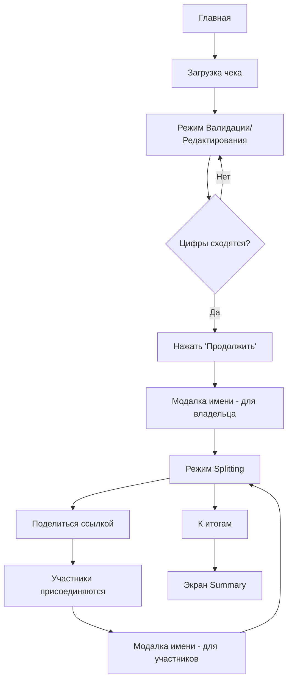

# План реализации разделения счёта

## Анализ текущего состояния

### Реализовано ✅
- Загрузка/сканирование чека
- Извлечение данных через AI
- Режим валидации (когда цифры не сходятся)
- Режим редактирования (редактирование с автоматическим пересчётом)
- История чеков
- Realtime обновления через SSE

### Нужно реализовать 🚧
1. **Режим Splitting** — разделение позиций между участниками
2. **Модалка имени** — присоединяющиеся участники устанавливают имя
3. **Экран итогов** — кто сколько должен
4. **Sharing** — QR-код и ссылка для приглашения

---

## Анализ конкурента (SplitCheck)


**Ключевые паттерны:**
- Под каждой позицией — бейджи участников с чекбоксами
- "Remainder" — остаток от общей суммы для контроля
- Fees (налоги/чаевые) распределяются пропорционально
- "Settle Up" — итоговый экран с детализацией по участникам

---

## Предлагаемый User Flow



---

## Макеты новых экранов

### 1. Режим Splitting (Разделить счёт)


**Функциональность:**
- Каждая позиция чека отображается карточкой
- Под позицией — аватары/бейджи всех участников
- Нажатие на бейдж = claim позиции (или её части)
- Варианты: "за себя" (фикс кол-во) / "разделить поровну"
- Кнопка "К итогам" внизу

### 2. Экран итогов (Summary)


**Функциональность:**
- Общая сумма чека сверху
- Список участников с их суммами
- Раскрывающаяся детализация: какие позиции, налоги, чаевые
- QR-код для быстрого шеринга
- Кнопка "Поделиться" (Web Share API / копирование ссылки)

### 3. Модалка ввода имени


**Функциональность:**
- Появляется при первом входе в режим splitting
- Появляется при присоединении по ссылке
- Имя сохраняется в участниках

---

## User Review Required

> [!IMPORTANT]
> **Необходимо решить перед реализацией:**
>
> 1. **Способ claim'а позиций**: Варианты:
>    - **Simple:** Каждый claim = вся позиция делится поровну между claim'нувшими
>    - **Advanced:** Можно указать точное кол-во (например, 2 из 5 шт) за себя
>    - **Hybrid:** По умолчанию поровну, но можно переключить на "точное кол-во"
>
> 2. **Распределение fees (налоги/сервисный сбор):**
>    - Поровну между всеми?
>    - Пропорционально сумме purchased items?
>
> 3. **Возврат к редактированию:** Нужна ли кнопка "Вернуться к редактированию" из режима splitting?
>
> 4. **Real-time синхронизация:** Сейчас есть SSE. Хватит ли его для синхронизации claims между участниками?

---

## Proposed Changes

### Database / Prisma Schema

#### [MODIFY] [schema.prisma](file:///Users/user/Developer/receipt-ai/prisma/schema.prisma)

Добавить модели для участников и claims:

```prisma
model Participant {
  id        String   @id @default(cuid())
  name      String
  receiptId String
  receipt   Receipt  @relation(fields: [receiptId], references: [id])
  claims    Claim[]
  createdAt DateTime @default(now())
}

model Claim {
  id            String      @id @default(cuid())
  positionId    String      // ID позиции в JSON (не FK)
  quantity      Float       // Сколько единиц взял (может быть дробь при делении)
  participantId String
  participant   Participant @relation(fields: [participantId], references: [id])
  createdAt     DateTime    @default(now())
}
```

---

### Model Layer

#### [NEW] [participant.ts](file:///Users/user/Developer/receipt-ai/model/participant/model.ts)

Типы и функции для расчёта сумм участников.

---

### API Routes

#### [NEW] [route.ts](file:///Users/user/Developer/receipt-ai/app/api/receipt/[id]/participants/route.ts)

CRUD для участников (POST создание, GET список).

#### [NEW] [route.ts](file:///Users/user/Developer/receipt-ai/app/api/receipt/[id]/claims/route.ts)

CRUD для claims (POST claim, DELETE unclaim).

---

### UI Components

#### [NEW] [SplittingView.tsx](file:///Users/user/Developer/receipt-ai/app/receipt/components/SplittingView/SplittingView.tsx)

Компонент режима splitting с позициями и бейджами участников.

#### [NEW] [SummaryView.tsx](file:///Users/user/Developer/receipt-ai/app/receipt/components/SummaryView/SummaryView.tsx)

Компонент итогов с расчётом сумм и шерингом.

#### [NEW] [NameModal.tsx](file:///Users/user/Developer/receipt-ai/app/receipt/components/NameModal/NameModal.tsx)

Модалка ввода имени.

#### [NEW] [ShareButton.tsx](file:///Users/user/Developer/receipt-ai/app/receipt/components/ShareButton/ShareButton.tsx)

Кнопка шеринга с QR и Web Share API.

---

### State Management

#### [MODIFY] [receipt-state.ts](file:///Users/user/Developer/receipt-ai/app/receipt/[id]/receipt-state.ts)

Добавить состояние для:
- Текущий режим: `editing` | `splitting` | `summary`
- Участники и их claims
- Текущий пользователь (имя)

---

## Verification Plan

### Automated Tests

Существующие тесты в проекте:
- `app/__tests__/state.test.ts`
- `app/receipt/[id]/__tests__/state.test.ts`
- `app/receipt/components/RowSheet/RowSheet.test.tsx`
- `model/receipt/__tests__/model.test.ts`

**Команда запуска:** `pnpm test` или `pnpm vitest`

Новые тесты:
- `model/participant/__tests__/model.test.ts` — расчёт сумм участников
- `app/receipt/components/SplittingView/__tests__/SplittingView.test.tsx` — claim/unclaim

### Manual Verification

1. **Flow проверка:**
   - Открыть чек → нажать "Продолжить" → появляется модалка имени → ввести имя → режим splitting
   
2. **Claim позиции:**
   - Нажать на свой бейдж под позицией → позиция claim'ится
   - Проверить что сумма пересчитывается в summary
   
3. **Sharing:**
   - Нажать "Поделиться" → скопировать ссылку
   - Открыть ссылку в другом браузере → появляется модалка имени
   - Ввести имя → видны все участники

---

## Текущее состояние приложения


**Записи исследования:**
- [Исследование текущего приложения](file:///Users/user/.gemini/antigravity/brain/3fe76030-230c-4058-85e4-0fab20800e9a/explore_current_app_1769909701178.webp)
- [Исследование конкурента SplitCheck](file:///Users/user/.gemini/antigravity/brain/3fe76030-230c-4058-85e4-0fab20800e9a/competitor_splitcheck_1769909821320.webp)
