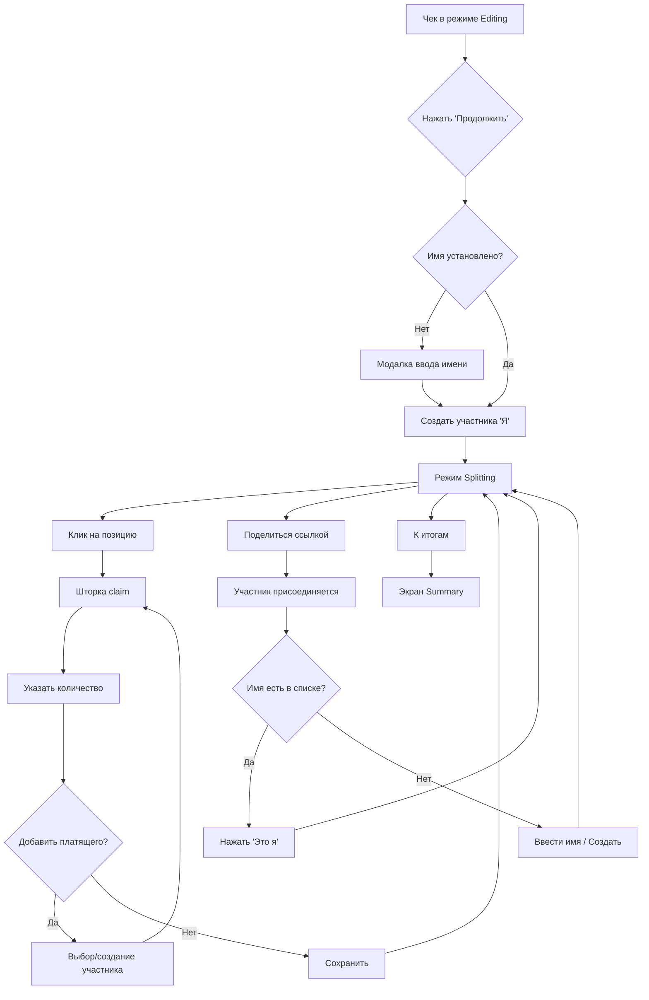

# UX-дизайн режима разделения счёта

## Обзор

Режим splitting позволяет участникам **claim'ить позиции чека** — указывать сколько единиц каждой позиции они оплачивают.

---

## Ключевые экраны

### 1. Таблица чека в режиме splitting


**Элементы:**
- Дополнительная колонка **"Платят"** — бейджи claim'нувших
- **Зелёный фон** — позиция полностью распределена
- **Оранжевая рамка** — есть остаток (не все единицы распределены)
- **Бар внизу** — сводка по участникам

---

### 2. Шторка claim'а позиции

При клике на ряд открывается шторка:


**Особенности:**
- Заголовок: название позиции + общая сумма
- Общее количество единиц
- Список участников с полями ввода количества
- **"+ Добавить платящего"** — добавить нового участника
- **Остаток** — показывает нераспределённые единицы
- Валидация: нельзя сохранить если `сумма claims > количество`

---

### 3. Управление участниками


**Сценарии:**
1. **Владелец** добавляет участников вручную (имена)
2. **Присоединившийся** может нажать **"Это я"** на существующем участнике
3. Можно создать нового участника

---

## User Flow



---

## Сценарии взаимодействия

### Сценарий 1: Владелец создаёт чек

1. Сканирует чек → редактирует
2. Нажимает **"Продолжить"** → вводит своё имя
3. Добавляет участников (Аня, Макс, Петя)
4. Claim'ит свои позиции
5. Делится ссылкой

### Сценарий 2: Участник присоединяется

1. Открывает ссылку
2. Видит список участников
3. **Случай A:** Видит своё имя → нажимает **"Это я"**
4. **Случай B:** Не видит → создаёт нового участника
5. Claim'ит свои позиции

### Сценарий 3: Ошибка — не тот участник

1. Пользователь понял что он не "Аня", а "Гость 1"
2. Открывает список участников
3. Нажимает **"Это я"** на нужном участнике
4. Система переназначает все claims

---

## Детали шторки claim'а

### Поля ввода количества

```
┌─────────────────────────────────────────┐
│  Суп Солянка - 3000 ₽                   │
├─────────────────────────────────────────┤
│  📦 Количество: 30 шт                   │
├─────────────────────────────────────────┤
│  Кто платит:                            │
│                                         │
│  [Я] Я (Иван)    [ 10 ] шт   = 1000₽   │
│  [А] Аня         [ 10 ] шт   = 1000₽   │
│  [М] Макс        [    ] шт             │
│                                         │
│  + Добавить платящего                   │
├─────────────────────────────────────────┤
│  ⚠️ Остаток: 10 шт (1000 ₽)             │
├─────────────────────────────────────────┤
│  [Отмена]              [Готово]         │
└─────────────────────────────────────────┘
```

### Валидация
- `Σ claims ≤ quantity` — сумма не может превышать количество
- `claim ≥ 0` — не может быть отрицательным
- `claim` может быть дробным (0.5 пиццы)

### Автоматический расчёт суммы

```
claim_amount = (claim_quantity / total_quantity) * position_total
```

---

## Текущий UI режима редактирования (для сравнения)


В режиме splitting шторка **заменяется** на шторку claim'а.

---

## Открытые вопросы

> [!IMPORTANT]
> 1. **Дробные количества:** Показывать как дроби (1/3) или десятичные (0.33)?
> 2. **Автораспределение остатка:** Добавить кнопку "Разделить остаток поровну"?
> 3. **Возврат в editing:** Кнопка сверху "К редактированию"?

---

## Запись исследования

- [Просмотр текущей шторки редактирования](file:///Users/user/.gemini/antigravity/brain/3fe76030-230c-4058-85e4-0fab20800e9a/current_rowsheet_1769910686325.webp)
