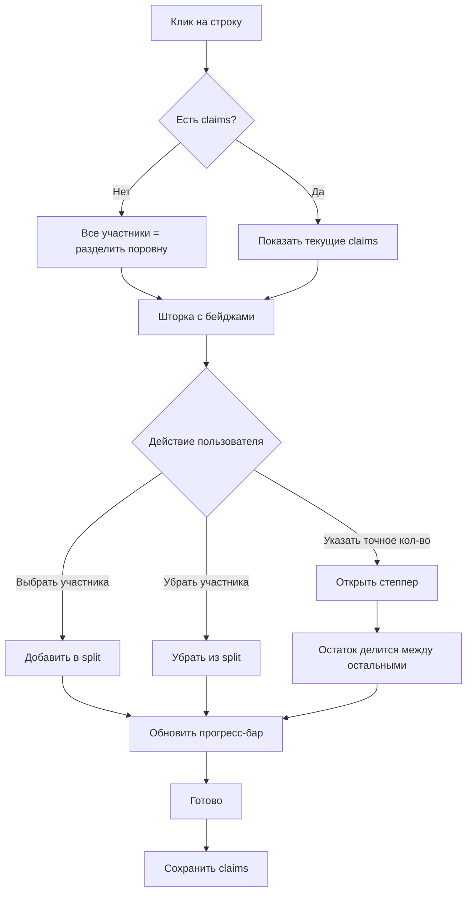

# UX-дизайн режима разделения v2

## Референс


---

## 1. Таблица чека в режиме splitting


**Элементы:**
- Колонки: Наименование | (qty) | Сумма | Участники + Progress
- **Цветные бейджи** участников рядом с каждой строкой
- **Мини-прогресс бар** — цветные сегменты показывают доли
- Нераспределённые строки — пунктирная рамка, пустой прогресс
- **Итоговый прогресс-бар** внизу — показывает общий split

---

## 2. Шторка Claim


**Структура:**
- **Заголовок:** `Название (xКол-во)` — количество редактируемое
- **Бейджи участников:** цветные рамки (оранжевый/синий/зелёный)
- **Прогресс-бар:** сегментированный по цветам участников
- Кнопки: Отмена | Готово

**Первый заход (нет claims):**
- По умолчанию выбран "Все" — вся позиция делится между всеми

---

## 3. Указание точного количества


**Когда участник хочет указать НЕ поровну:**
1. Нажимает на свой бейдж (долго или через меню)
2. Появляется степпер: `[ - ] 15 шт [ + ] = 1500₽`
3. Остаток делится между остальными отмеченными

**Логика расчёта:**
```
fixed_claims = участники с точным количеством
shared_participants = участники с "Ост." (остаток)
remaining = total_qty - Σ(fixed_claims)
per_shared = remaining / count(shared_participants)
```

---

## Цветовая схема участников

| Участник | Цвет обводки |
|----------|--------------|
| Я        | 🟠 Оранжевый #F59E0B |
| Аня      | 🔵 Синий #3B82F6 |
| Макс     | 🟢 Зелёный #22C55E |
| Петя     | 🟣 Фиолетовый #A855F7 |
| Гость N  | ⚫ Серый #6B7280 |

---

## Прогресс-бар

```
┌──────────────────────────────────────────┐
│ ██████████████ ▓▓▓▓▓▓▓▓▓▓ ░░░░░░░░░░░░░ │
│   Я: 35%        Аня: 30%    Не распр: 35%│
└──────────────────────────────────────────┘
```

- Цветные сегменты = доли участников
- Серый = нераспределённый остаток
- Появляется под каждой строкой И в футере таблицы

---

## User Flow



---

## Итоговый UI таблицы

При **>1 строке** в таблице — итоговый прогресс-бар:

```
┌────────────────────────────────────────────────┐
│  Я: 3500₽ (32%)  │  Аня: 4200₽ (38%)  │  ... │
│  ████████████████ ▓▓▓▓▓▓▓▓▓▓▓▓▓▓▓▓▓▓▓ ░░░░░░ │
└────────────────────────────────────────────────┘
```
