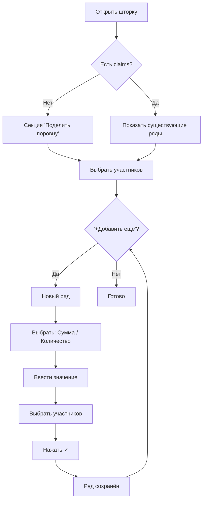

# UX-дизайн Claim Sheet

## Референс

---

## Состояние 1: Пустое (никто не заполнял)

**Элементы:**
- Заголовок: `Суп Солянка (x30)` — `3000 ₽`
- Секция **"Поделить поровну"**: `(x30) 3000₽`, бейджи участников
- Кнопка **"+ Добавить ещё"**
- **Индикатор распределения**: полностью серый (не распределено)

---

## Состояние 2: Добавление по сумме

**Элементы:**
- Dropdown: `[Сумма ▼]` + инпут `[ 500 ] ₽`
- **Зелёная галочка ✓** — подтвердить
- Бейджи для выбора участников
- Индикатор: пустой (пока не заполнен)

---

## Состояние 3: Добавление по количеству

**Элементы:**
- Dropdown: `[Количество ▼]` + инпут `[ 5 ] шт` + расчёт `= 500₽`
- **Зелёная галочка ✓** — подтвердить
- Бейджи участников

---

## Состояние 4: Заполненное

**Элементы:**
- Ряд 1: `(x10) 1000₽` — Я + Аня (50%/50%)
- Ряд 2: `500₽` — Петя (100%)
- Ряд 3: `(x5) 500₽` — Макс + Женя (50%/50%)
- **Карандашик 🖊️** — редактировать ряд
- Общий индикатор: **"Полностью распределено ✓"**

---

## Логика UI

---

## Индикатор распределения

- **Сплошная линия** без градиентов
- Цветные сегменты = доли участников
- Серый полупрозрачный = не распределено
- Каждый ряд + общий внизу
