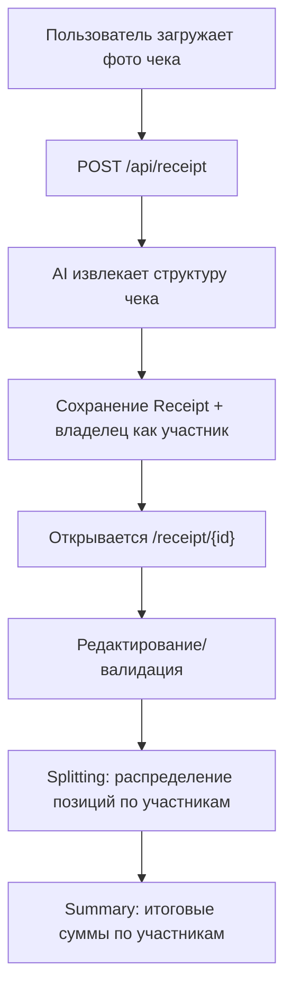
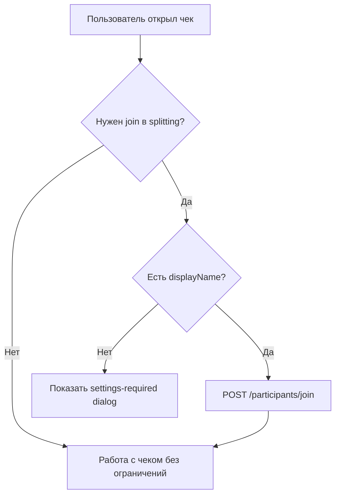
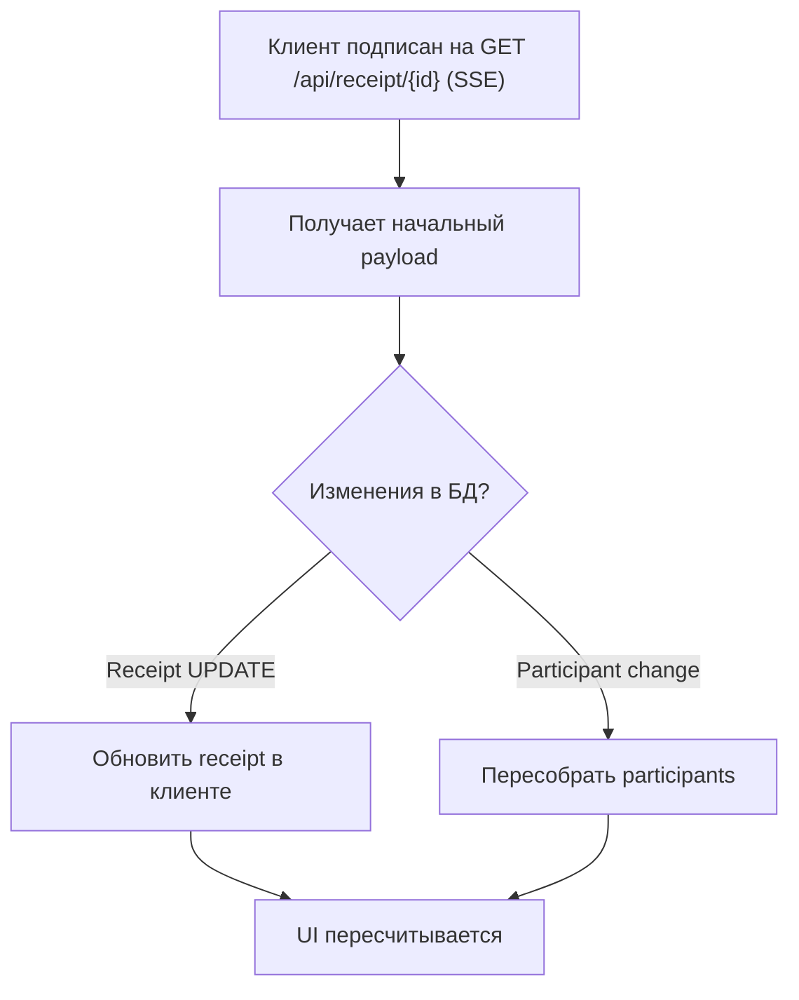

# Документация Проекта `receipt-ai`

## 1. Общее описание проекта

`receipt-ai` — приложение для совместного деления чека между участниками.

Какие задачи решает:
- Автоматически извлекает позиции, суммы, скидки и сборы из фото чека через AI.
- Позволяет проверить и поправить данные чека перед расчетами.
- Позволяет распределить позиции чека между участниками.
- Считает итоговую сумму для каждого участника.
- Синхронизирует изменения между вкладками/пользователями в реальном времени.

Ключевая идея:
- Данные чека живут как JSON в `Receipt.data`.
- Участники хранятся отдельно в реляционных таблицах (`real` и `mock`).
- Клиент получает объединенный payload `{ receipt, participants }` по SSE.

## 2. Поверхностно о технологическом стеке

- `Next.js 16` + `React 19` + `TypeScript`.
- UI: `Tailwind CSS` + `Radix UI` (локальные обертки в `components/ui/*`).
- Формы: `react-hook-form`.
- Валидация схем: `zod`.
- Состояние: `zustand` (участники), локально `rxjs` в `join-flow`.
- База: `PostgreSQL` через `Prisma`.
- Auth/Realtime/Storage: `Supabase`.
- AI-парсинг чека: `LangChain` + `OpenRouter`.
- Тесты: `Vitest` + `Testing Library`.

## 3. Юзер-сценарии

### 3.1 Основной сценарий: от фото до итогов

Текстом:
1. Пользователь отправляет фото чека.
2. Бэкенд парсит чек, валидирует математику, сохраняет результат.
3. Пользователь попадает на страницу чека и при необходимости корректирует данные.
4. В режиме splitting указывает, кто за что платит.
5. Видит экран summary с итогами по каждому участнику.

### 3.2 Сценарий входа участника в splitting (join-flow)

Текстом:
1. Система проверяет, должен ли пользователь быть участником в splitting.
2. Если у пользователя нет `displayName`, показывается обязательное окно настроек.
3. Если `displayName` есть, выполняется join через API.
4. После join пользователь участвует в расчётах.

### 3.3 Сценарий совместной работы (SSE)

Текстом:
1. Клиент открывает SSE-стрим конкретного чека.
2. При изменениях `Receipt` и таблиц участников сервер отправляет обновленный payload.
3. UI автоматически обновляется и пересчитывает состояние/экраны.

## 4. Что еще хорошо бы документировать

Рекомендуемые следующие документы:
- **`docs/ARCHITECTURE.md`**: границы модулей, ответственность слоев, data flow между API, stores и UI.
- **`docs/API.md`**: полный контракт каждого endpoint (request/response/errors).
- **`docs/REALTIME.md`**: правила SSE, reconnection-стратегия, идемпотентность обновлений.
- **`docs/TESTING.md`**: какие тесты обязательны для PR и какие сценарии считаются критичными.
- **`docs/OPERATIONS.md`**: env-переменные, деплой, миграции Prisma, аварийные действия.
