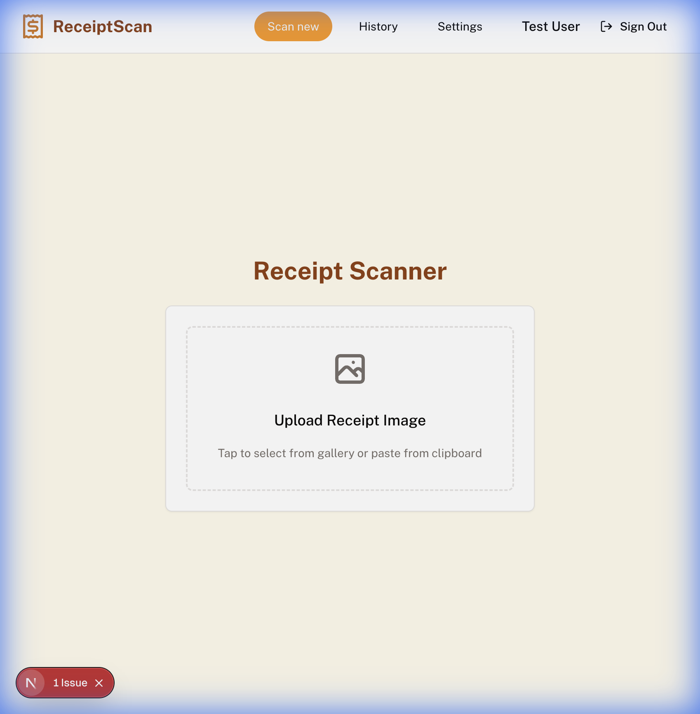
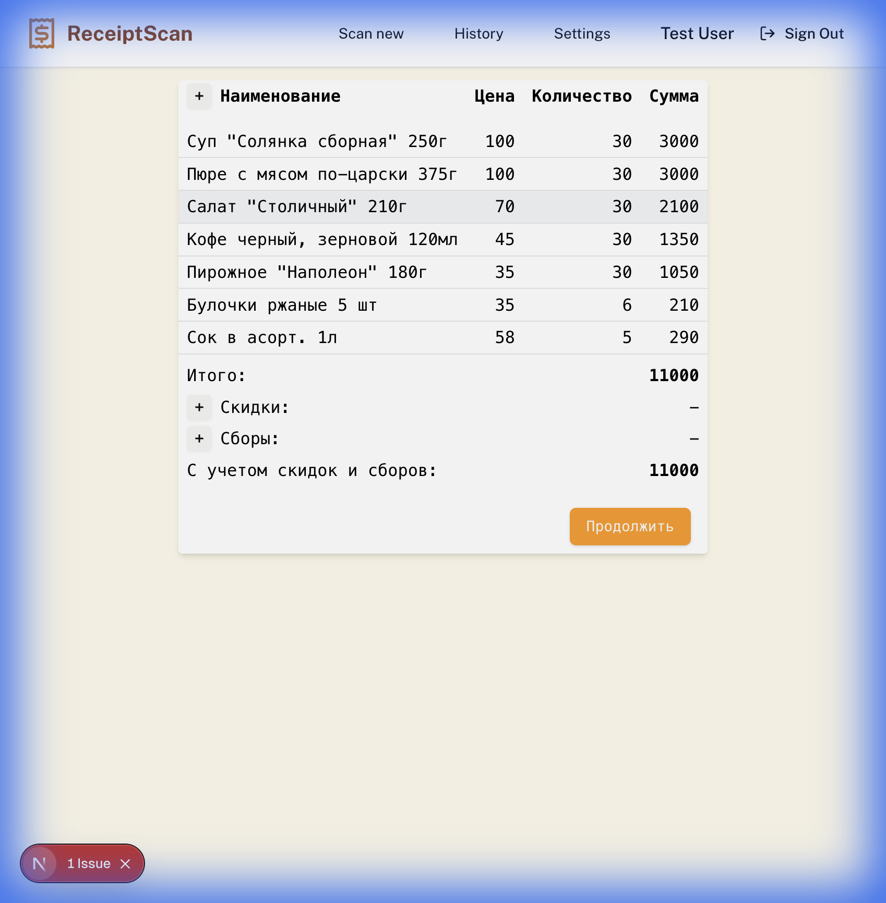
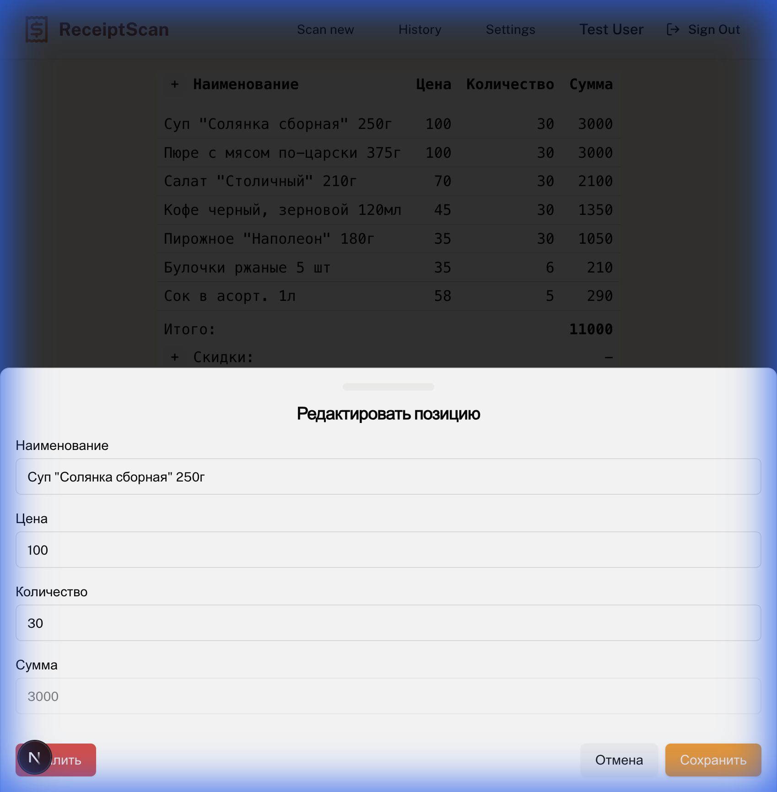
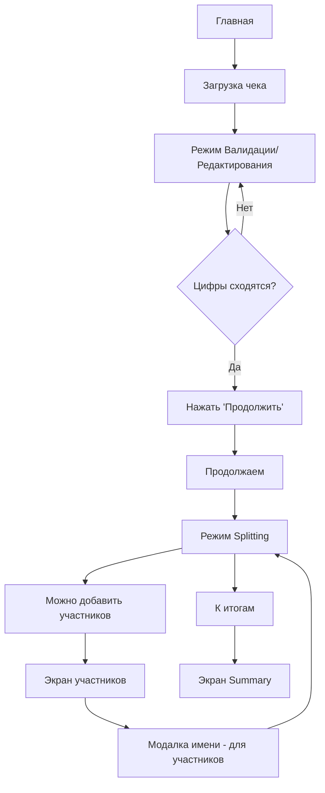
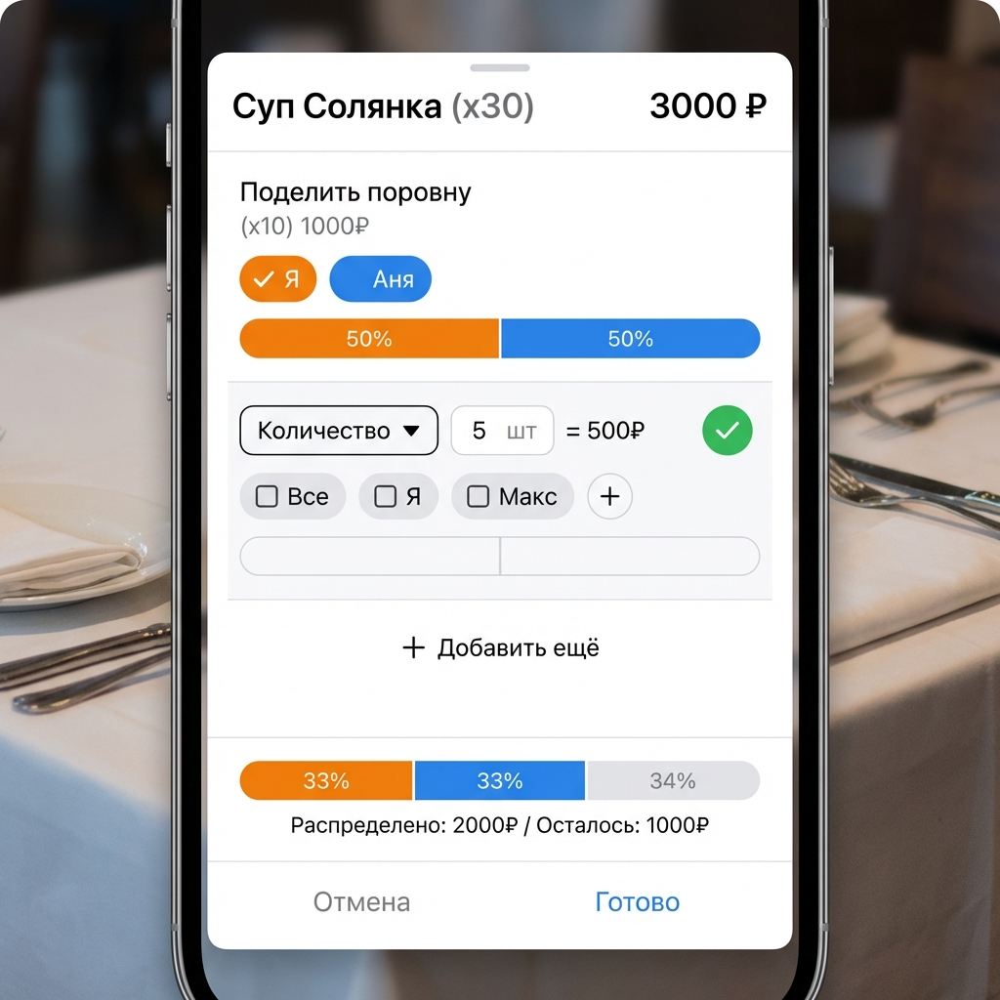
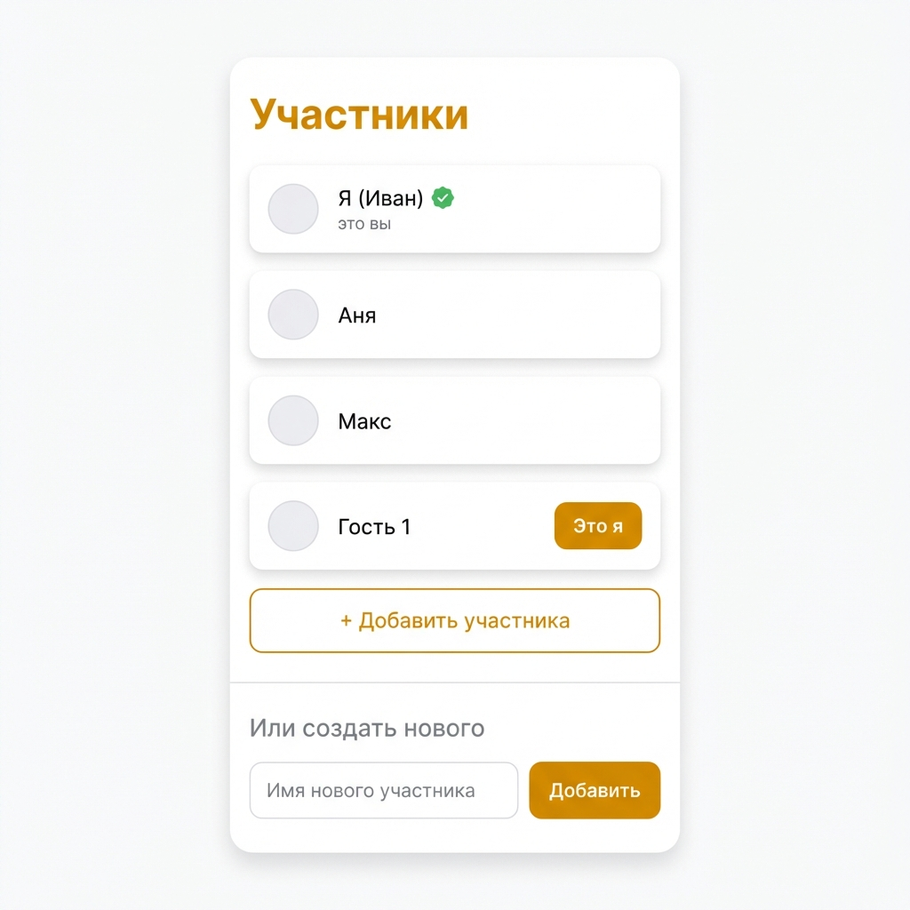
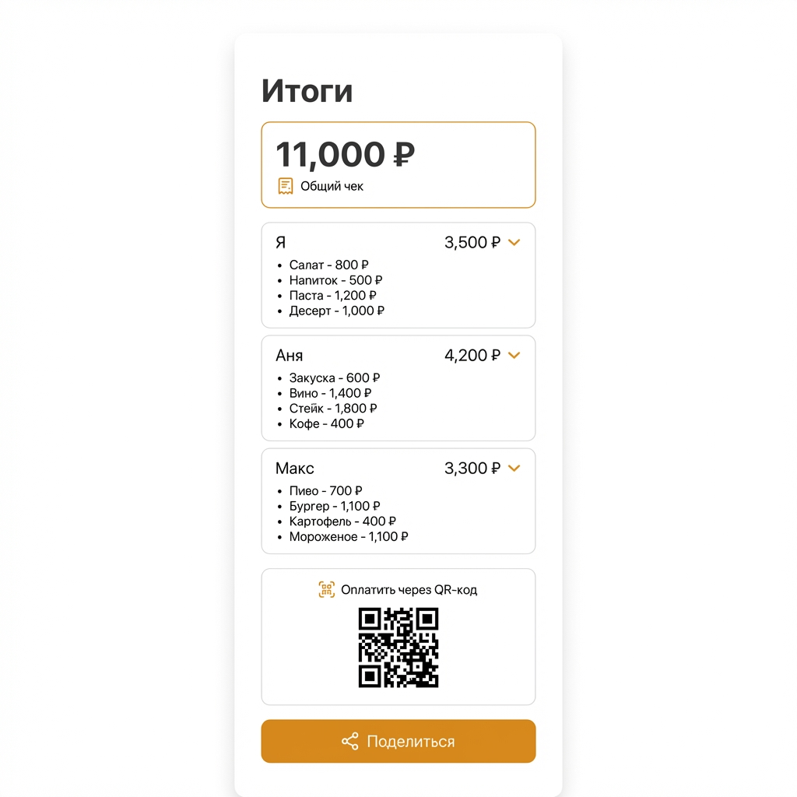

# UX-дизайн режима разделения счёта

## Обзор проекта

### Реализовано ✅
- Загрузка/сканирование чека
- Извлечение данных через AI
- Режим валидации (когда цифры не сходятся)
- Режим редактирования (с автоматическим пересчётом)
- История чеков
- Realtime обновления через SSE

### Нужно реализовать 🚧
1. **Экран участников** 
2. **Режим Splitting** — разделение позиций между участниками

---

### Текущий UI приложения





---

## User Flow



---

## Claim Sheet — Финальный дизайн

> Шторка для одной позиции чека. Внутри — несколько **рядов-сплитов**, каждый распределяет часть позиции.

### Требования от заказчика

1. **Структура:**
   - Сверху секция **"Поделить поровну"**
   - Кнопка **"+ Добавить ещё"** для создания нового ряда
   - Каждый ряд имеет **индикатор распределения**
   - Общий **индикатор распределения** внизу шторки

2. **Добавление ряда:**
   - В заголовке выбор: **Сумма** или **Количество**
   - Инпут для ввода значения
   - **Зелёная галочка ✓** — подтвердить (понятная и компактная)

3. **После сохранения:**
   - Заголовок становится текстом (не инпуты)
   - **Карандашик пастельных тонов 🖊️** — редактировать

4. **Бейджи участников:**
   - Каждый участник обведён **определённым цветом**
   - Если нет аватарки — **первая буква имени** тем же цветом

5. **Индикатор распределения:**
   - Заполненная линия **без градиентов**
   - Неоплаченное = **прозрачный серый**

---

### Примерный макет



**Элементы:**
- Инпут: `5 шт`
- Dropdown: `[Количество ▼]/[Сумма ▼]`
- Автоматический расчёт: `= 500₽`
- **Зелёная галочка ✓**

---

### Список участников



**Функциональность:**
- Показать всех участников
- Кнопка **"Это я"** — присоединившийся может "стать" существующим участником
- **"+ Добавить участника"** — перейти в экран участников. Там можно создать нового.

> [!NOTE]
> **Это я** — будем уточнять детали в следующих итерациях, пропускаем

---

### Экран итогов (Summary)



**Функциональность:**
- Общая сумма чека сверху
- Список участников с их суммами
- Раскрывающаяся детализация
- QR-код для шеринга
- Кнопка "Поделиться"

---


### Индикатор распределения

```
┌────────────────────────────────────────────┐
│ ████████ │ ██████ │ ████ │ ░░░░░░░░░░░░░ │
└────────────────────────────────────────────┘
```

- **Сплошные цвета** (без градиентов)
- Серый полупрозрачный = нераспределено
- Показывается: под каждым рядом + общий внизу шторки/таблицы
