# ReceiptForm: продуктовый reference-документ

> Статус: post factum documentation по текущему поведению экрана
>
> Источники: текущее поведение `ReceiptForm`, `useReceiptFormState`, browser-тесты `ReceiptFormInner.browser.test.tsx`, screenshot-baseline из `__screenshots__`
>
> Область охвата: сама форма чека и встроенный `Join flow`-overlay, так как он напрямую меняет доступ к рабочим режимам формы. Внешние подсистемы `presence`/`SSE` как самостоятельные домены не документируются, кроме влияния на пользовательское поведение экрана.
>
> Правило показа визуалов в этом документе: ключевые состояния встроены inline, вторичные и диагностические визуалы вынесены в `
`. Если важного скриншота нет, это явно помечено в тексте.

---

## 1. Зачем нужен этот документ

Этот документ описывает `ReceiptForm` как пользовательский экран и как продуктовую систему принятия решений. Его цель не просто перечислить UI-элементы, а зафиксировать:

- какие пользовательские задачи экран решает на самом деле;
- какие `modes` и `states` определяют его поведение;
- какие сценарии считаются основными;
- какие `edge cases` уже поддерживаются и почему это важно;
- какие инварианты нельзя ломать при дальнейшем развитии;
- где текущая модель сильна, а где уже видны архитектурные и UX-ограничения.

Это продуктовый документ, но его детальность делает его пригодным для:

- стратегических решений по развитию экрана;
- QA-регрессии;
- онбординга разработчиков;
- обсуждения редизайна без потери уже зафиксированного поведения.

---

## 2. Что такое `ReceiptForm`

`ReceiptForm` это экран, на котором пользователь проходит полный цикл работы с распознанным чеком:

1. осматривает распознанные позиции;
2. при необходимости исправляет ошибки структуры или сумм;
3. распределяет позиции между участниками;
4. управляет `fees` и `discounts`;
5. завершает сценарий и переходит к `summary`.

Важно: экран не является просто формой редактирования данных. Он совмещает в себе сразу несколько продуктовых ролей:

- viewer распознанного чека;
- validator проблемного чека;
- editor позиций, totals и modifiers;
- распределительный интерфейс для claims;
- summary-представление итогов.

Это делает экран очень насыщенным по логике. Практически вся сложность здесь возникает не из количества компонентов, а из совмещения нескольких пользовательских режимов внутри одного surface.

---

## 3. Ментальная модель экрана

### 3.1. Экран как система состояний

У формы есть три основных `scenario.type`:

- `validation`
- `splitting`
- `summary`

Поведение экрана определяется не только текущими данными `Receipt`, но и тем, какой `scenario.type` вычислен в `useReceiptFormState`.

Упрощённо:

- `validation` означает: чек пока нельзя считать готовым к нормальному распределению;
- `splitting` означает: чек можно распределять и редактировать;
- `summary` означает: пользователь временно вышел из режима редактирования и смотрит на итоговую раскладку.

### 3.2. Главная продуктовая идея

Экран построен вокруг одной ключевой развилки:

- пока чек не приведён в состояние, пригодное для использования, экран ведёт пользователя через `validation`;
- как только чек достаточно валиден для работы, интерфейс смещается в `splitting`;
- когда распределение завершено или пользователь хочет посмотреть итог, экран переключается в `summary`.

То есть форма не просто “показывает чек”, а проводит пользователя по последовательности зрелости данных.

### 3.3. Критически важное различие между “invalid” и “claim issues”

В логике `getType()` у формы есть важная особенность: не все ошибки равноправны.

Если `receiptValidationSchema` не проходит, но все ошибки находятся в `positions.*.claims`, форма считает это особым случаем:

- чек формально не полностью валиден;
- но пользователь всё ещё может работать в `splitting`;
- это означает, что ошибки распределения считаются разрешимыми внутри распределительного режима, а не поводом возвращать весь экран в общий режим исправления.

Это одна из самых важных продуктовых границ экрана.

---

## 4. Карта режимов

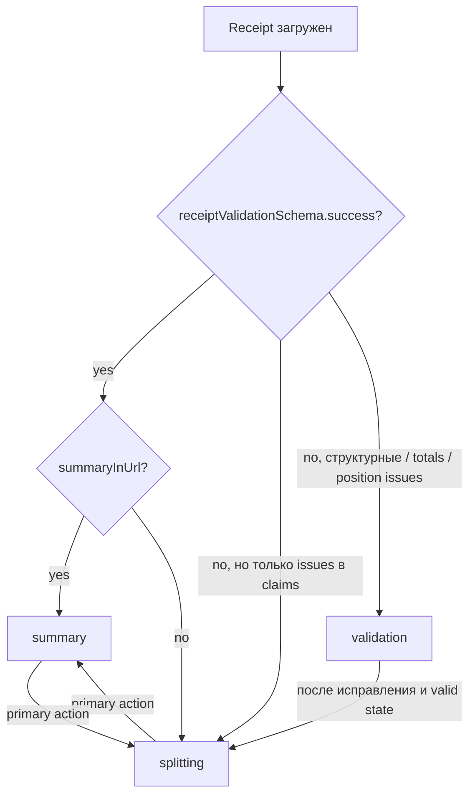
```mermaid
flowchart TD
    A["Receipt загружен"] --> B{"receiptValidationSchema.success?"}
    B -->|yes| C{"summaryInUrl?"}
    B -->|no, но только issues в claims| D["splitting"]
    B -->|no, структурные / totals / position issues| E["validation"]
    C -->|yes| F["summary"]
    C -->|no| D
    D -->|primary action| F
    F -->|primary action| D
    E -->|после исправления и valid state| D
```

### 4.1. `validation`

Назначение:
экран принудительного приведения чека к продуктово допустимому состоянию.

Свойства:

- `positionForm: true`
- `modifierForm: true`
- `totalsForm: true`
- primary action показывает `Готово`, но `canProceed = false`, пока форма невалидна
- `summary` недоступен

Пользовательская логика:

- пользователь должен устранить ошибки в позициях или totals;
- экран не скрывает чек, а позволяет исправлять его прямо в текущем surface;
- после восстановления валидности пользователь без смены экрана попадает в `splitting`.

Базовый скриншот:

[Скриншот](../../app/receipt/components/__tests__/__screenshots__/ReceiptFormInner.browser.test.tsx/invalid-review-mode-chromium.png)
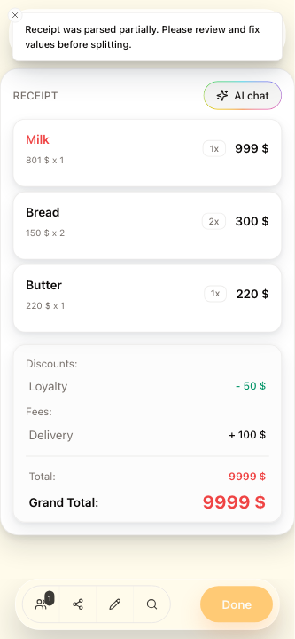

### 4.2. `splitting`

Назначение:
основной рабочий режим формы.

Свойства:

- `positionForm: true`
- `modifierForm: true`
- `totalsForm: false`
- primary action активна, если форма валидна
- поиск доступен
- позиции интерактивны
- totals видимы, но не редактируемы

Пользовательская логика:

- можно распределять позиции;
- можно добавлять и редактировать позиции;
- можно добавлять и редактировать `fees` / `discounts`;
- totals пересчитываются автоматически;
- primary action переводит экран в `summary`.

Базовый скриншот:

[Скриншот](../../app/receipt/components/__tests__/__screenshots__/ReceiptFormInner.browser.test.tsx/receipt-overview-chromium.png)

### 4.3. `summary`

Назначение:
режим итогового просмотра без активного редактирования.

Свойства:

- `positionForm: false`
- `modifierForm: false`
- `totalsForm: false`
- поиск скрыт
- primary action возвращает в `splitting`

Пользовательская логика:

- пользователь смотрит, кому что досталось;
- экран показывает breakdown по участникам и остаток;
- при потере валидности серверным обновлением экран сам уходит обратно из `summary`.

Базовые скриншоты:

[Скриншот](../../app/receipt/components/__tests__/__screenshots__/ReceiptFormInner.browser.test.tsx/summary-empty-state-chromium.png)
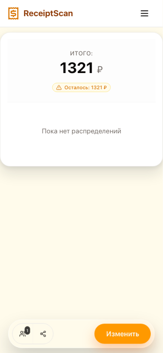

Дополнительные `summary`-состояния

[Скриншот](../../app/receipt/components/__tests__/__screenshots__/ReceiptFormInner.browser.test.tsx/summary-balances-chromium.png)
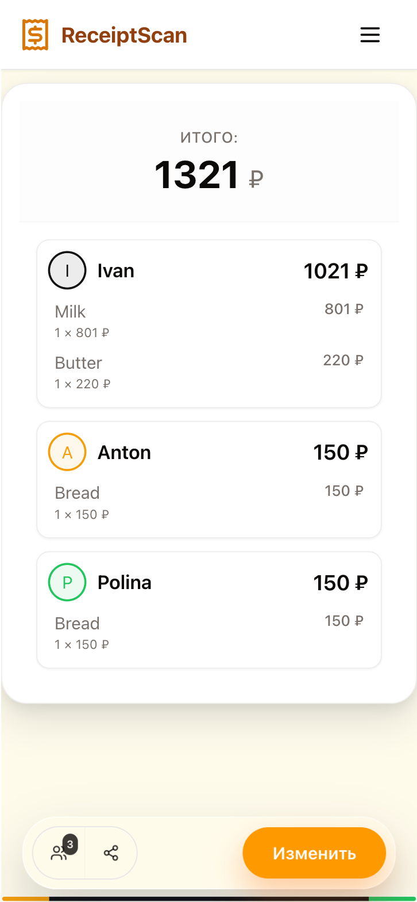

[Скриншот](../../app/receipt/components/__tests__/__screenshots__/ReceiptFormInner.browser.test.tsx/summary-remaining-chromium.png)
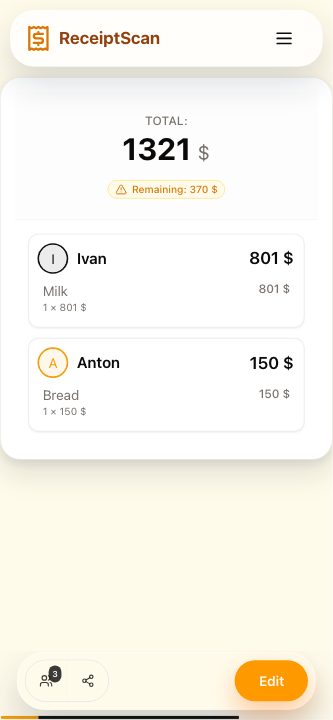

---

## 5. Постоянные зоны интерфейса

### 5.1. Список позиций

Это главный объект взаимодействия в `validation` и `splitting`.

Каждая строка позиции показывает:

- `name`
- `price`
- `quantity`
- `overall`
- `DistributionBar`

Если `positionForm` доступен, строка кликабельна и открывает редактирование или `splitting`-view в зависимости от контекста.

Семантически строка позиции делает две вещи одновременно:

- является summary карточкой текущих данных;
- служит action surface для углубления в работу с позицией.

### 5.2. Totals block

В нижней карточке формы пользователь всегда видит:

- `total`
- `grandTotal`
- список `discounts` и `fees`, если они есть

Но поведение зависит от режима:

- в `validation` totals интерактивны и открывают editing dialog;
- в `splitting` totals только отображаются;
- в `summary` сама форма скрыта, и пользователь уже не работает с этим блоком напрямую.

### 5.3. `ReceiptActionBar`

Это основной action surface экрана.

Он объединяет:

- participants;
- share;
- edit menu;
- search;
- primary action.

Важная продуктовая особенность:
action bar не просто панель кнопок, а главный переключатель между пользовательскими сценариями. Именно здесь пользователь получает доступ к созданию новых сущностей и к завершению этапа работы.

### 5.4. `SearchBar`

Поиск открывается поверх интерфейса отдельным portal-layer, а не встраивается внутрь списка.

Это означает:

- у поиска есть собственный overlay state;
- он временно влияет на видимость/доступность action bar;
- поиск живёт как отдельный UI-режим поверх текущего сценария.

### 5.5. Editing surfaces

На экране используются два разных editing surface:

- `Dialog` для обычного редактирования;
- `Drawer` (`SplittingSheet`, `ParticipantsSheet`) для контекстов, где важна мобильная/flow-oriented работа.

Это не случайное различие. Оно разделяет:

- редактирование структуры данных;
- работу в глубоком подрежиме распределения.

### 5.6. AI chat

AI chat это встроенный вторичный workflow поверх `ReceiptForm`, а не отдельный экран. Он запускается из `ReceiptActionBar` и открывается как `Dialog`-overlay поверх текущего состояния формы.

Продуктовая роль AI-чата:

- дать быстрый естественно-языковой вход в работу с чеком;
- показывать предпросмотр AI-изменений до применения;
- не скрывать, что именно AI предлагает изменить;
- оставаться подчинённым основной форме, а не заменять её.

Сейчас у AI-чата есть три пользовательских режима ответа:

- обычный текстовый ответ (`question`);
- `structural_preview` с diff относительно текущего чека;
- `claims_preview` с распределениями по участникам.

#### Entry point

Кнопка AI находится в той же строке, что и название чека. Визуально она выделена радужной обводкой и читается как вход именно в чат, а не в “магическую автоправку”.

#### Chat dialog

После открытия пользователь получает отдельный диалог с историей сообщений, системными сообщениями про tool-events и полем ввода. Это overlay-режим: форма остаётся под ним, но сам чат не переводит экран в другой `scenario.type`.

| | | |
| --- | --- | --- |
|  | 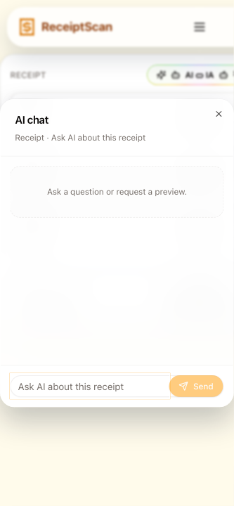 | 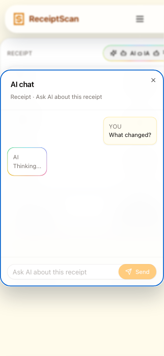 |

#### Structural preview

`structural_preview` показывает не просто новый чек, а построчный diff с текущим состоянием:

- новые строки подсвечены как `Добавлено`;
- удалённые строки помечены как `Удалено`;
- изменённые строки показывают старые значения зачёркнутыми и новые рядом.

Это важная продуктовая гарантия прозрачности: AI не “молча меняет чек”, а визуально объясняет, что именно будет переписано в форме.

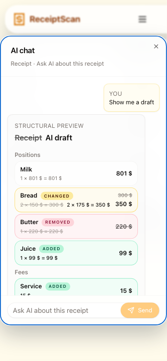

Этот кадр специально снят на увеличенном viewport, чтобы верх и низ structural preview помещались в один экран без разрезания на две картинки.

Structural preview user stories

### User story 1: AI предлагает добавить одну позицию и пользователь применяет structural preview

**Цель пользователя**  
Быстро принять простое структурное предложение от AI и сразу увидеть, что чек уже приведён к этому состоянию.

**Что происходит**  
AI предлагает добавить одну позицию. В preview новая строка явно подсвечивается как `Added`, а кнопка `Review changes` открывает подтверждение применения. После `Apply` изменения записываются в форму, и тот же structural preview больше не показывает diff как pending change: карточка становится зеленоватой, а кнопка `Review changes` исчезает.

**Продуктовый смысл**  
Structural preview должен быть одновременно прозрачным до применения и очевидно “схлопываться” в applied-state после применения. Пользователь не должен гадать, осталось ли ещё что-то применить.

| AI предлагает добавить одну позицию | Structural preview после применения |
| --- | --- |
| 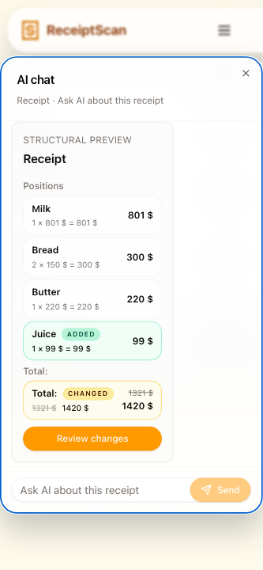 | 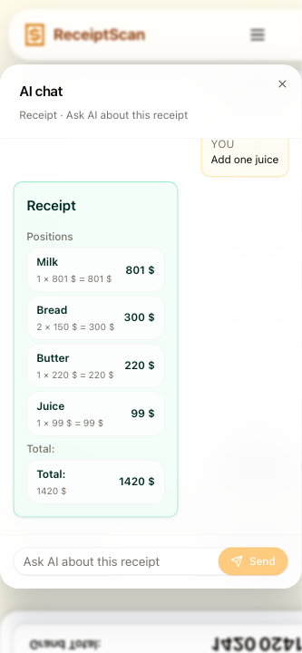 |

[Скриншоты](../../app/receipt/components/__tests__/__screenshots__/ReceiptFormInner.browser.test.tsx/ai-chat-structural-preview-added-one-chromium.png) и [applied state](../../app/receipt/components/__tests__/__screenshots__/ReceiptFormInner.browser.test.tsx/ai-chat-structural-preview-applied-chromium.png)

### User story 2: перед применением пользователь видит warning о потере claims

**Цель пользователя**  
Понять, что structural apply может затронуть уже распределённые позиции, и принять это осознанно.

**Что происходит**  
Если применение `structural_preview` приводит к потере уже вынесенных claims, confirmation step показывает warning-блок `Claims that may be lost` со списком конкретных потерь.

**Продуктовый смысл**  
Structural apply всегда разрешён, но не должен скрывать стоимость этого действия. Потери claims должны быть перечислены до подтверждения, а не после.

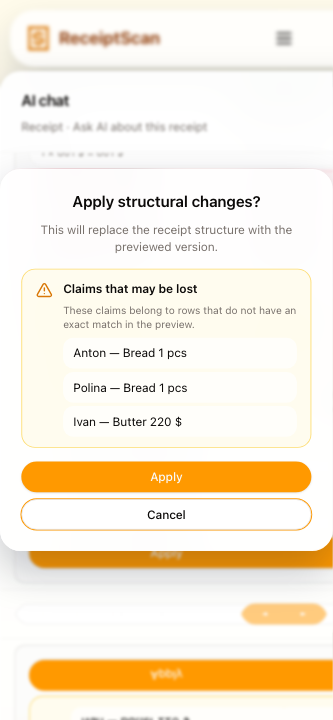

#### Claims preview

`claims_preview` работает иначе. Он не показывает новый summary-экран целиком, а строит participant-only preview распределений по текущему чеку. Верхний блок `total / remaining` намеренно скрыт: здесь важен именно ответ на вопрос “кому AI распределила позиции”, а не повторный итог всего экрана.

Семантически это preview распределений, а не preview структуры.

[Скриншот](../../app/receipt/components/__tests__/__screenshots__/ReceiptFormInner.browser.test.tsx/ai-chat-claims-preview-chromium.png)
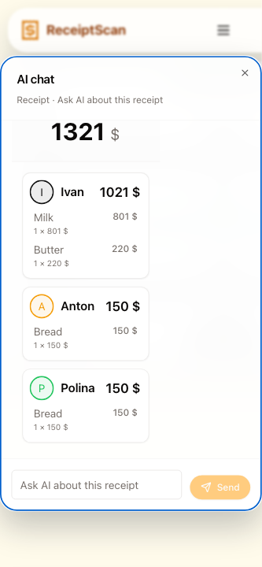

#### Продуктовые инварианты AI-чата

- AI chat не заменяет основные режимы `validation / splitting / summary`, а живёт поверх них.
- `structural_preview` и `claims_preview` подчиняются разным контрактам и не должны смешиваться.
- structural flow обязан быть визуально объясним через diff.
- claims flow обязан быть редуцируем к `Record<positionId, Claim[]>`, иначе это malformed AI response, а не новая форма данных.
- tool-events вроде запроса исходных фото чека должны быть видимы пользователю как системные сообщения, а не скрытые внутренние шаги.

---

## 6. Каталог пользовательских сценариев

Ниже сценарии сгруппированы по пользовательскому намерению. Это главная рабочая часть документа.

---

## 6A. Join flow: фактическое поведение

### Роль join flow в продукте

`Join flow` это вход в чек перед основной работой с экраном.

Продуктовая роль:

- не пускать в чек без имени и понятной роли;
- позволять быстро вернуть себе уже созданное анонимное участие;
- явно показывать, если пользователь потерял доступ к чеку.

### Инварианты join flow

- если пользователь уже присоединился к чеку, окно входа не открывается;
- если пользователь еще не в чеке, но имя уже есть, система пытается присоединить его автоматически;
- если пользователь еще не в чеке и имени нет, открывается окно настройки профиля;
- в списке «Это я» показываются только офлайн анонимные участники;
- после успешного входа окно настройки не должно появляться снова без новой причины;
- если пользователя удалили из чека, экран должен показать отдельное состояние «вас удалили».

### Сценарий: пользователь без имени попадает в Settings

**Цель пользователя**  
Войти в чек и продолжить работу в форме.

**Что происходит**  
Если у пользователя нет имени профиля, сразу открывается окно настройки с полем имени.

**Продуктовый смысл**  
Имя является обязательным входным атрибутом для участия в чеке.

[Скриншот](../../app/receipt/components/__tests__/__screenshots__/ReceiptFormInner.browser.test.tsx/join-settings-open-when-display-name-missing-chromium.png)

### Сценарий: есть offline anonymous кандидаты

**Цель пользователя**  
Забрать свою уже существующую “анонимную” запись без создания нового участника.

**Что происходит**  
В окне настройки появляется блок «уже участвовали» со списком людей, под чьим именем можно продолжить. Список прокручивается внутри блока.

**Продуктовый смысл**  
Это снижает дубли участников и упрощает identity resolution.

[Скриншот](../../app/receipt/components/__tests__/__screenshots__/ReceiptFormInner.browser.test.tsx/join-settings-shows-offline-anonymous-candidates-chromium.png)
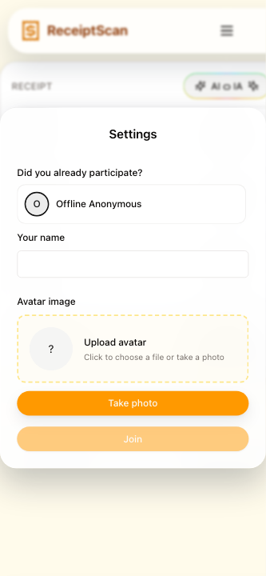

### Сценарий: вход в чек по имени

**Цель пользователя**  
Присоединиться как новый участник с именем.

**Что происходит**  
После ввода имени становится доступна кнопка `Join`. При отправке лишние пробелы в начале и конце имени убираются.

**Продуктовый смысл**  
Система не допускает пустые/шумовые значения имени и унифицирует сохранение профиля.

[Скриншот](../../app/receipt/components/__tests__/__screenshots__/ReceiptFormInner.browser.test.tsx/can-join-when-name-is-typed-chromium.png)
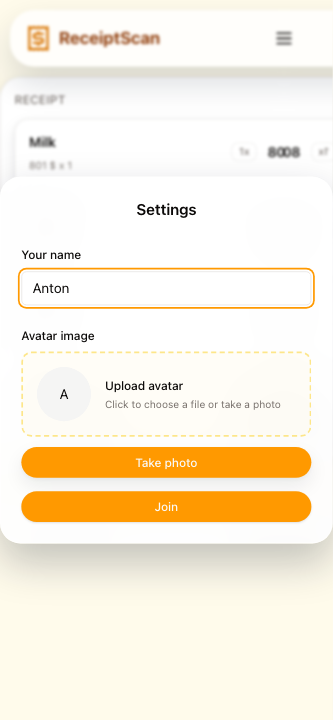

### Сценарий: ожидание во время входа

**Цель пользователя**  
Понимать, что запрос выполняется, и не терять контекст.

**Что происходит**  
Пока запрос на вход не завершен, окно настройки остается открытым и не закрывается само.

**Продуктовый смысл**  
Пользователь не теряет контроль над состоянием входа.

[Скриншот](../../app/receipt/components/__tests__/__screenshots__/ReceiptFormInner.browser.test.tsx/join-settings-stays-open-while-request-pending-chromium.png)
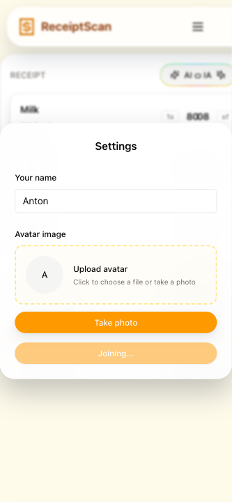

[Скриншот](../../app/receipt/components/__tests__/__screenshots__/ReceiptFormInner.browser.test.tsx/join-candidate-replace-pending-chromium.png)
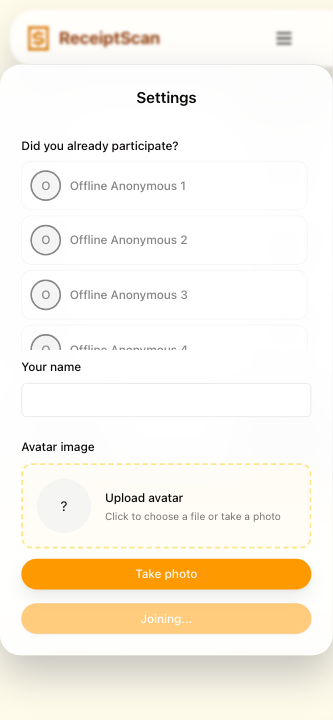

### Сценарий: вход через существующего офлайн-анонима

**Цель пользователя**  
Войти “в свою” уже созданную offline-anonymous запись.

**Что происходит**  
Нажатие на кандидата означает «это я»: пользователь забирает эту запись и продолжает работу уже от нее.

**Продуктовый смысл**  
Это основной способ вернуться в чек после предыдущего анонимного участия.

[Скриншот](../../app/receipt/components/__tests__/__screenshots__/ReceiptFormInner.browser.test.tsx/join-candidate-action-replaces-offline-anon-real-chromium.png)

### Сценарий: удаление пользователя после join

**Цель пользователя**  
Получить явный сигнал, что доступ к чеку потерян.

**Что происходит**  
Если пользователь уже был в чеке, а затем исчез из списка участников, открывается состояние «вас удалили» с кнопкой `Go home`.

**Продуктовый смысл**  
Это защитная ветка доступа: форма не должна оставаться в рабочем режиме для удалённого участника.

[Скриншот](../../app/receipt/components/__tests__/__screenshots__/ReceiptFormInner.browser.test.tsx/join-removed-state-after-server-removal-chromium.png)
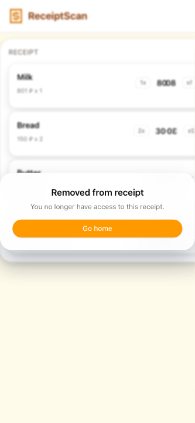

### Сценарий: загрузка аватара во время join

**Цель пользователя**  
Завершить вход с персонализированным профилем.

**Что происходит**  
В окне настройки можно загрузить фото, подвинуть и увеличить его в круглом кадрировании, применить результат и затем завершить вход.

**Продуктовый смысл**  
Пользователь завершает вход в чек и настройку профиля в одном потоке, без переходов по другим экранам.

[Скриншот](../../app/receipt/components/__tests__/__screenshots__/ReceiptFormInner.browser.test.tsx/join-avatar-upload-settings-open-chromium.png)
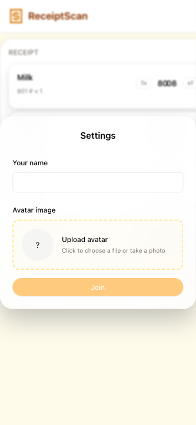

[Скриншот](../../app/receipt/components/__tests__/__screenshots__/ReceiptFormInner.browser.test.tsx/join-avatar-upload-crop-open-chromium.png)
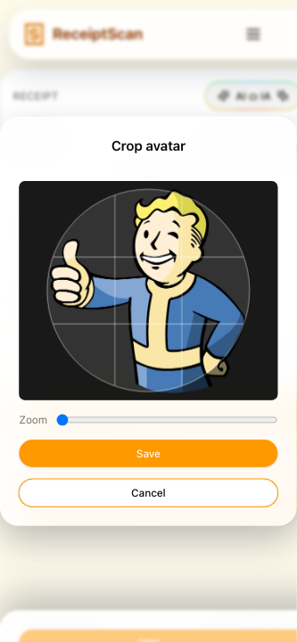

[Скриншот](../../app/receipt/components/__tests__/__screenshots__/ReceiptFormInner.browser.test.tsx/join-avatar-upload-zoom-slider-used-chromium.png)
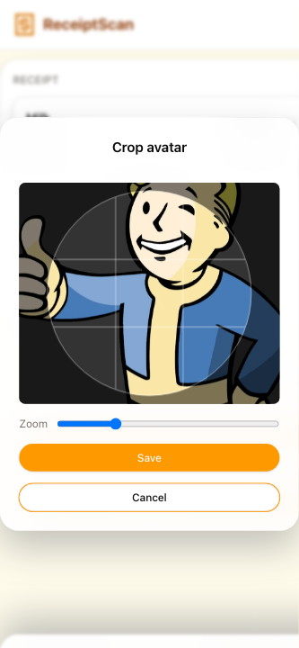

[Скриншот](../../app/receipt/components/__tests__/__screenshots__/ReceiptFormInner.browser.test.tsx/join-avatar-upload-crop-applied-chromium.png)
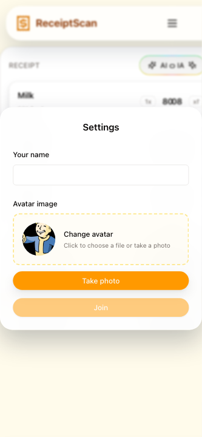

[Скриншот](../../app/receipt/components/__tests__/__screenshots__/ReceiptFormInner.browser.test.tsx/join-avatar-upload-submit-chromium.png)
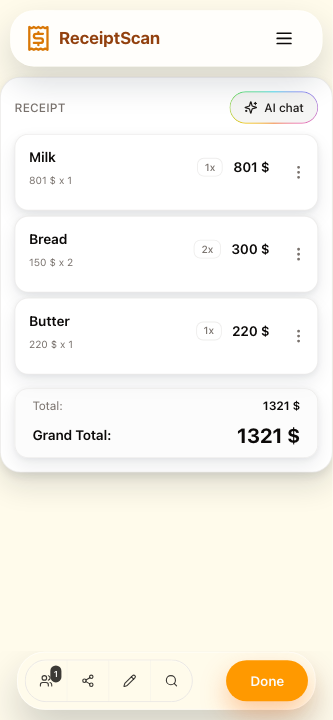

---

## 7. Сценарии: первичный осмотр чека

### 7.1. Открыть чек и получить базовый обзор

**Цель пользователя**
Понять, что распознано, какие позиции есть, какие totals получились и можно ли продолжать.

**Точка входа**
Экран открывается в `splitting`, если чек валиден или содержит только claim-related issues.

**Что пользователь видит**

- заголовок `Чек`;
- список позиций;
- totals block;
- search action;
- participants action;
- primary action `Готово`;
- отсутствие summary-блока.

**Продуктовый смысл**
Это canonical working state формы. Если команда обсуждает развитие экрана, именно это состояние должно считаться базовой нормой, от которой измеряются все усложнения.

[Скриншот](../../app/receipt/components/__tests__/__screenshots__/ReceiptFormInner.browser.test.tsx/receipt-overview-chromium.png)

### 7.2. Открыть чек, который требует ревью

**Цель пользователя**
Увидеть, что чек нельзя сразу распределять, и получить ясный сигнал о блокировке.

**Точка входа**
Экран вычисляется как `validation`.

**Что пользователь видит**

- чек остаётся видимым;
- позиции не исчезают;
- search остаётся доступным;
- primary action `Готово` визуально присутствует, но disabled;
- режим не отправляет пользователя на отдельный “экран ошибки”.

**Продуктовый смысл**
Система не прерывает основной user journey, а встраивает исправление ошибок в тот же экран. Это снижает переключение контекста, но увеличивает плотность логики внутри формы.

[Скриншот](../../app/receipt/components/__tests__/__screenshots__/ReceiptFormInner.browser.test.tsx/invalid-review-mode-chromium.png)

---

## 8. Сценарии: переход между `splitting` и `summary`

### 8.1. Перейти из `splitting` в `summary`

**Цель пользователя**
Посмотреть итог распределения.

**Предусловие**
`formState.isValid === true`.

**Механика**
Нажатие primary action вызывает `proceed()`, которое при `type === "splitting"` выставляет `summaryInUrl = true`.

**Продуктовый смысл**
`summary` здесь не отдельный page transition, а alternate representation той же формы, переключаемый query-state.

**Скриншот**
Скриншот перехода как отдельного шага отсутствует.

### 8.2. Вернуться из `summary` в `splitting`

**Цель пользователя**
Продолжить редактирование после просмотра итогов.

**Механика**
Primary action в `summary` вызывает тот же `proceed()`, но теперь он снимает `summaryInUrl`.

**Продуктовый смысл**
Одна и та же primary action работает как toggle между рабочим и итоговым представлением.

**Скриншот**
Скриншот перехода как отдельного шага отсутствует.

### 8.3. Открыть `summary`, если распределений пока нет

**Цель пользователя**
Проверить итоговый режим даже до появления claims.

**Что пользователь видит**

- пустое summary state;
- кнопку возврата в editing;
- отсутствие search.

[Скриншот](../../app/receipt/components/__tests__/__screenshots__/ReceiptFormInner.browser.test.tsx/summary-empty-state-chromium.png)

### 8.4. Попытаться открыть `summary` для invalid receipt

**Пользовательский смысл**
URL может содержать `summary=1`, но экран не обязан безусловно его уважать.

**Правило**
Если receipt invalid, `summary` не открывается, даже если query-state его просит.

**Почему это важно**
Это защищает продукт от режима, в котором итоговая витрина показывала бы семантически недостоверные данные.

[Скриншот](../../app/receipt/components/__tests__/__screenshots__/ReceiptFormInner.browser.test.tsx/summary-invalid-query-fallback-chromium.png)
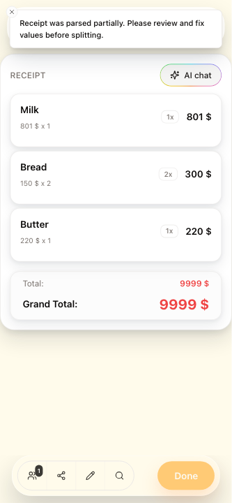

### 8.5. Потерять валидность уже в `summary`

**Пользовательский смысл**
Серверное обновление может сделать чек invalid уже после входа в итоговый режим.

**Правило**
Экран автоматически уходит из `summary` назад в рабочий режим исправления.

[Скриншот](../../app/receipt/components/__tests__/__screenshots__/ReceiptFormInner.browser.test.tsx/summary-fallback-to-validation-chromium.png)

Edge cases для transitions

#### `summary` не является самостоятельным суверенным режимом

Он всегда производен от:

- `summaryInUrl`
- текущей валидности receipt

Если одно из условий перестаёт быть истинным, экран должен отказываться от `summary`.

#### `summary` не должен становиться “тихой ошибкой”

Если invalid state возвращается с сервера, форма не должна сохранять красивый итоговый режим ради визуальной стабильности. В этом продукте корректность важнее визуальной непрерывности.

---

## 9. Сценарии: поиск

### 9.1. Открыть поиск

**Цель пользователя**
Сузить видимый список позиций без потери текущего контекста.

**Особенность реализации**
Поиск живёт в portal-layer поверх формы.

**Продуктовый смысл**
Поиск не перестраивает страницу, а действует как временный режим фокусировки.

[Скриншот](../../app/receipt/components/__tests__/__screenshots__/ReceiptFormInner.browser.test.tsx/search-open-empty-chromium.png)
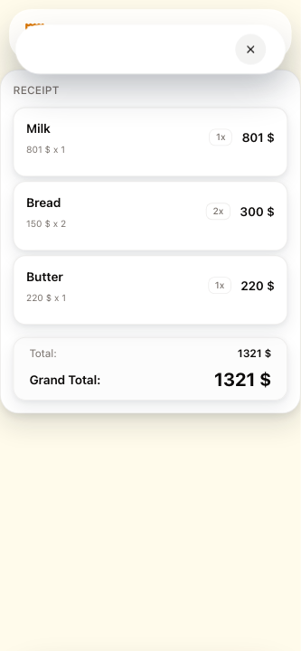

### 9.2. Найти конкретную позицию

**Цель пользователя**
Оставить в списке только релевантные строки.

**Поведение**

- поиск фильтрует `displayPositions`, а не редактирует исходные данные;
- totals block продолжает отображаться;
- позиция остаётся интерактивной.

[Скриншот](../../app/receipt/components/__tests__/__screenshots__/ReceiptFormInner.browser.test.tsx/search-filtered-milk-chromium.png)

### 9.3. Не найти ничего, но сохранить totals

**Цель пользователя**
Понять, что совпадений нет, не потеряв при этом ощущение контекста чека.

**Что важно**

- показывается empty state;
- позиции скрываются;
- totals не исчезают.

**Продуктовый смысл**
Поиск работает как фильтр списка, а не как альтернативный экран.

[Скриншот](../../app/receipt/components/__tests__/__screenshots__/ReceiptFormInner.browser.test.tsx/search-empty-state-chromium.png)

### 9.4. Закрыть поиск с непустым запросом

**Правило**
Нажатие close при непустом значении сначала очищает query, а не закрывает overlay.

**Продуктовый смысл**
Это двухшаговое закрытие уменьшает риск случайной потери найденного контекста.

[Скриншот](../../app/receipt/components/__tests__/__screenshots__/ReceiptFormInner.browser.test.tsx/search-query-cleared-chromium.png)

### 9.5. Сохранить фокус после очистки запроса

**Правило**
Если close-button очищает непустой query, input остаётся в фокусе.

[Скриншот](../../app/receipt/components/__tests__/__screenshots__/ReceiptFormInner.browser.test.tsx/search-query-cleared-focused-chromium.png)
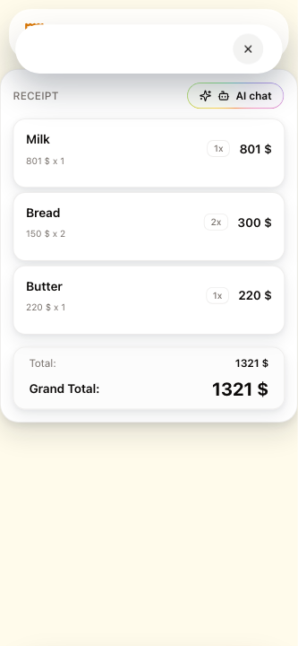

### 9.6. Закрыть пустой поиск по blur

**Правило**
Если input пустой, blur закрывает search overlay.

[Скриншот](../../app/receipt/components/__tests__/__screenshots__/ReceiptFormInner.browser.test.tsx/search-closed-on-blur-chromium.png)

### 9.7. Повторно открыть поиск после blur

**Правило**
После закрытия по blur поиск должен открыться снова без застревания в промежуточном состоянии.

[Скриншот](../../app/receipt/components/__tests__/__screenshots__/ReceiptFormInner.browser.test.tsx/search-open-empty-chromium.png)

### 9.8. Закрыть поиск по `Escape`

**Правило**

- `Escape` очищает query;
- search overlay закрывается;
- список возвращается к полному состоянию.

[Скриншот](../../app/receipt/components/__tests__/__screenshots__/ReceiptFormInner.browser.test.tsx/search-escape-clears-and-closes-chromium.png)

### 9.9. Считать whitespace-only query пустым

**Правило**
Пробелы не должны создавать fake-empty-state.

[Скриншот](../../app/receipt/components/__tests__/__screenshots__/ReceiptFormInner.browser.test.tsx/search-whitespace-query-chromium.png)

### 9.10. Повторно открыть поиск после `Escape`

**Правило**
После `Escape` пользователь возвращается в пустой search, а не в предыдущее значение.

[Скриншот](../../app/receipt/components/__tests__/__screenshots__/ReceiptFormInner.browser.test.tsx/search-reopened-after-escape-chromium.png)

### 9.11. Сохранить search context при открытии `SplittingSheet`

**Цель пользователя**
Уйти в детализацию позиции, не потеряв найденный фрагмент списка.

**Поведение**

- `SplittingSheet` открывается;
- search input остаётся;
- filtered state сохраняется;
- невидимые по фильтру позиции не возвращаются.

[Скриншот](../../app/receipt/components/__tests__/__screenshots__/ReceiptFormInner.browser.test.tsx/search-over-splitting-sheet-chromium.png)
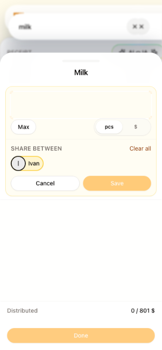

### 9.12. Сохранить search context при открытии participants

**Поведение**
Открытие `ParticipantsSheet` не должно сбрасывать фильтр.

[Скриншот](../../app/receipt/components/__tests__/__screenshots__/ReceiptFormInner.browser.test.tsx/search-over-participants-sheet-chromium.png)
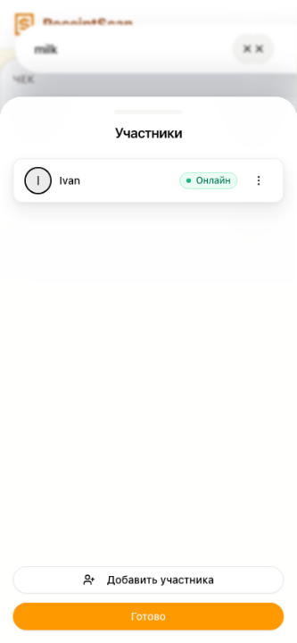

### 9.13. Перестроить результаты поиска после внешнего rename

Два уже зафиксированных сценария:

- позиция пропадает из filtered list, если больше не совпадает с query;
- позиция появляется в filtered list, если начинает совпадать.

**Продуктовый смысл**
Поиск работает поверх live data, а не поверх frozen snapshot.

**Скриншоты**
[Скриншот](../../app/receipt/components/__tests__/__screenshots__/ReceiptFormInner.browser.test.tsx/search-rename-removed-match-chromium.png)

[Скриншот](../../app/receipt/components/__tests__/__screenshots__/ReceiptFormInner.browser.test.tsx/search-rename-added-match-chromium.png)
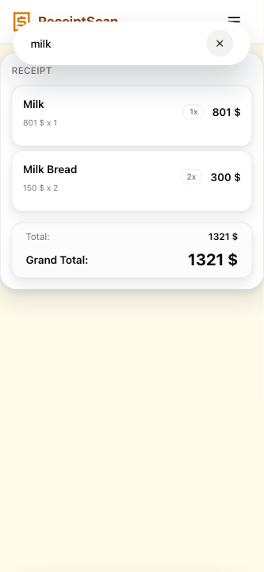

Edge cases поиска

#### Поиск не должен ломать totals readability

Даже при пустом результате пользователь всё ещё находится внутри чека, а не в отдельном режиме “поиска по базе”.

#### Search query это UI-state, а не domain-state

Он влияет только на `displayPositions`, но не должен менять данные receipt.

#### Search должен быть устойчив к server updates

Переименование позиции из внешнего обновления немедленно пересчитывает видимый filtered list. Это важно для live collaboration и server echo.

---

## 10. Сценарии: распределение позиций в `splitting`

### 10.1. Открыть partially distributed позицию

**Цель пользователя**
Продолжить работу с позицией, где распределение ещё не завершено.

**Что пользователь получает**

- `SplittingSheet` открывается сразу в draft editor;
- `Сохранить` initially disabled;
- доступны participant selection controls;
- текущий пользователь поднимается в начало списка.

**Продуктовый смысл**
Экран отдаёт приоритет продолжению действия, а не чтению истории claims.

[Скриншот](../../app/receipt/components/__tests__/__screenshots__/ReceiptFormInner.browser.test.tsx/splitting-draft-editor-chromium.png)
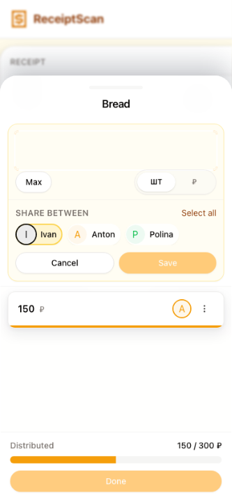

### 10.2. Открыть fully distributed позицию

**Цель пользователя**
Просмотреть существующие claims без навязывания нового draft.

**Что пользователь видит**

- нет кнопки `Сохранить`;
- есть список существующих claims;
- доступны actions редактирования;
- показана агрегированная арифметика позиции.

[Скриншот](../../app/receipt/components/__tests__/__screenshots__/ReceiptFormInner.browser.test.tsx/splitting-claims-list-chromium.png)
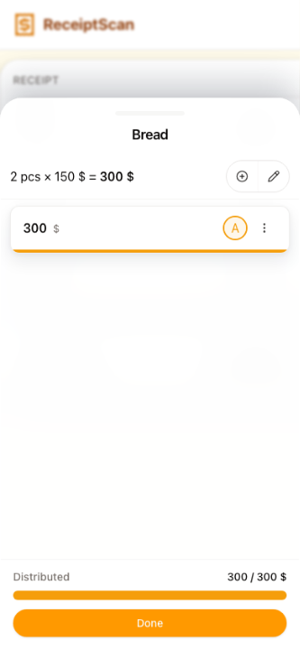

### 10.3. Ввод числа в draft editor

Зафиксированные правила:

- trailing decimal separator сохраняется во время набора;
- leading dot превращается в `0.`

**Продуктовый смысл**
Инпут ведёт себя как tolerant numeric editor, а не как жёсткий parser на каждом keypress.

**Скриншоты**
[Скриншот](../../app/receipt/components/__tests__/__screenshots__/ReceiptFormInner.browser.test.tsx/splitting-trailing-decimal-chromium.png)
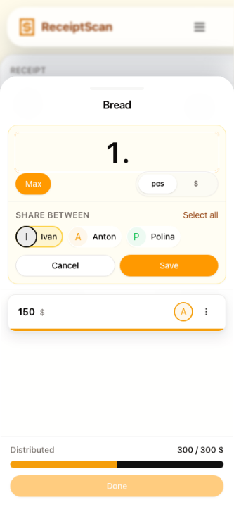

[Скриншот](../../app/receipt/components/__tests__/__screenshots__/ReceiptFormInner.browser.test.tsx/splitting-leading-dot-normalized-chromium.png)
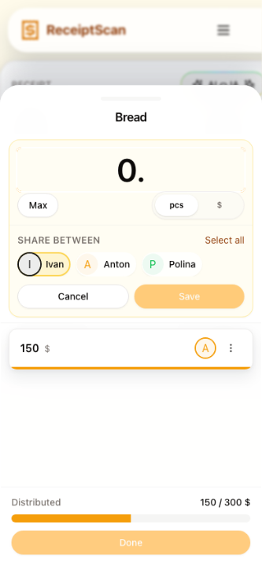

### 10.4. Создать новый draft из fully distributed позиции

**Цель пользователя**
Добавить ещё одну долю к уже полностью распределённой позиции.

**Поведение**

- из claims list можно открыть новый draft;
- `Сохранить` initially disabled;
- доступны actions выбора участников.

[Скриншот](../../app/receipt/components/__tests__/__screenshots__/ReceiptFormInner.browser.test.tsx/splitting-add-share-draft-chromium.png)
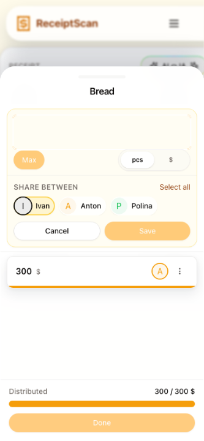

### 10.5. Сохранить новую claim

**Поведение**

- draft editor исчезает;
- claim становится видимой в claims list;
- строка claim становится новой интерактивной сущностью.

[Скриншот](../../app/receipt/components/__tests__/__screenshots__/ReceiptFormInner.browser.test.tsx/splitting-claim-created-chromium.png)
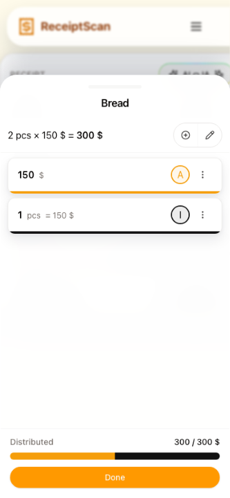

### 10.6. Отредактировать существующую claim

**Поведение**
После сохранения updated claim отображается в списке без промежуточного зависания в draft state.

[Скриншот](../../app/receipt/components/__tests__/__screenshots__/ReceiptFormInner.browser.test.tsx/splitting-claim-edited-chromium.png)
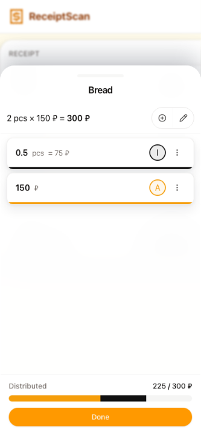

### 10.7. Выбрать всех / снять всех

**Продуктовый смысл**
Это bulk-selection shortcut для draft editor.

[Скриншот](../../app/receipt/components/__tests__/__screenshots__/ReceiptFormInner.browser.test.tsx/splitting-select-all-cleared-chromium.png)
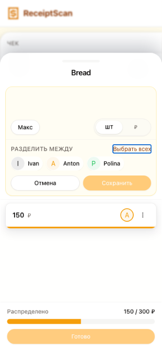

### 10.8. Переключать отдельных участников

**Поведение**
Локальная работа с participant selection не должна ломать bulk actions и draft validity.

[Скриншот](../../app/receipt/components/__tests__/__screenshots__/ReceiptFormInner.browser.test.tsx/splitting-participant-toggled-chromium.png)
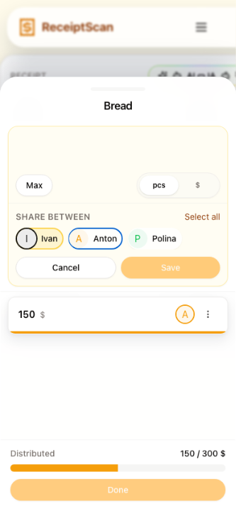

### 10.9. `Макс` в quantity mode

**Правило**
В quantity mode `Макс` заполняет максимальное допустимое количество.

[Скриншот](../../app/receipt/components/__tests__/__screenshots__/ReceiptFormInner.browser.test.tsx/splitting-max-quantity-chromium.png)
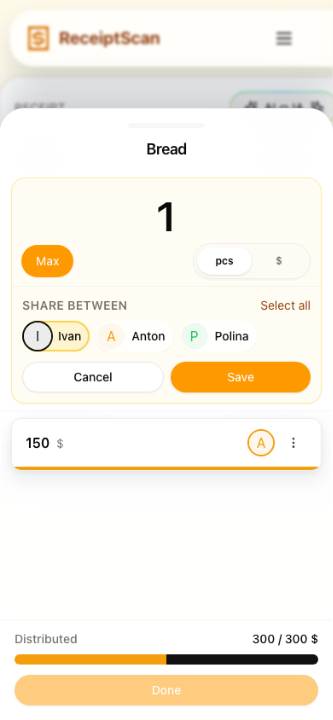

### 10.10. `Макс` в amount mode

**Правило**
В amount mode `Макс` заполняет максимально допустимую сумму.

[Скриншот](../../app/receipt/components/__tests__/__screenshots__/ReceiptFormInner.browser.test.tsx/splitting-max-amount-chromium.png)
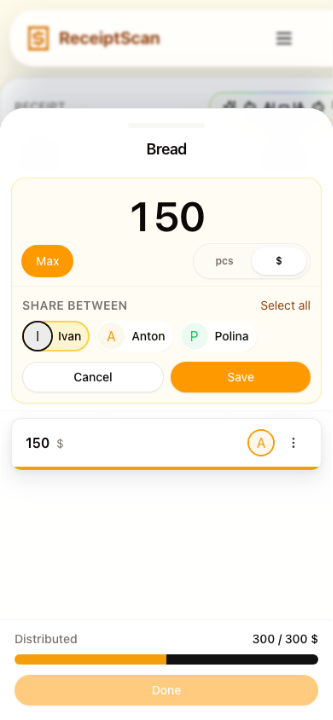

### 10.11. Переключение quantity claim в amount

**Поведение**
При смене единицы пересчитывается состояние `Макс`.

[Скриншот](../../app/receipt/components/__tests__/__screenshots__/ReceiptFormInner.browser.test.tsx/splitting-quantity-to-amount-switch-chromium.png)
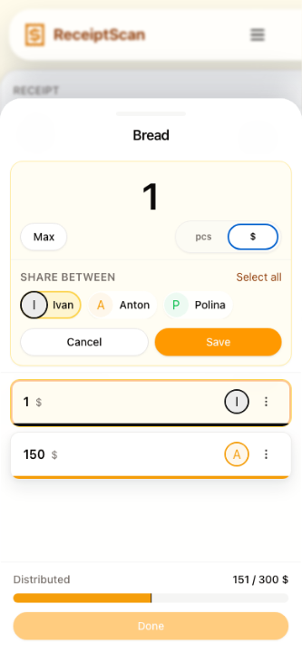

### 10.12. Переключение amount max в quantity с потерей валидности

**Правило**
Если после смены единицы `max` больше невалиден, `Сохранить` становится disabled.

**Смысл**
Форма отказывается сохранять неконсистентный claim даже при том, что пользователь пришёл к нему через валидное промежуточное состояние.

[Скриншот](../../app/receipt/components/__tests__/__screenshots__/ReceiptFormInner.browser.test.tsx/splitting-invalid-max-switch-chromium.png)
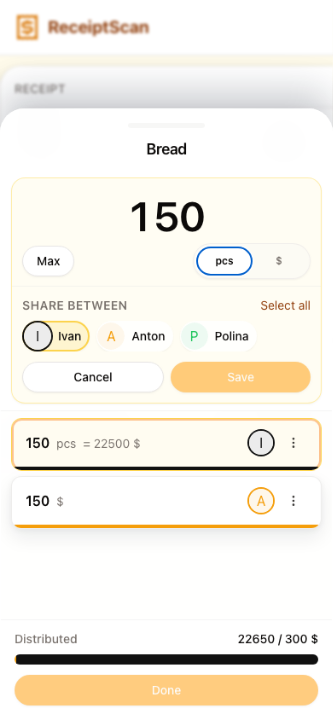

### 10.13. Удалить существующую claim

**Поведение**
После удаления claim пропадает из списка, без её “призрачного” сохранения в UI.

[Скриншот](../../app/receipt/components/__tests__/__screenshots__/ReceiptFormInner.browser.test.tsx/splitting-claim-deleted-chromium.png)
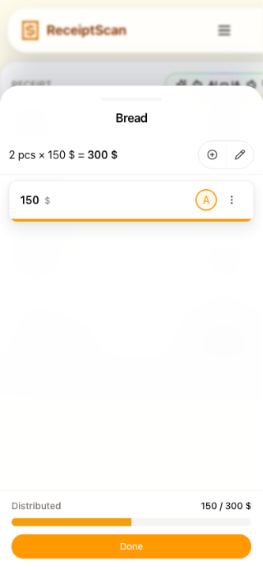

### 10.14. Закрыть `SplittingSheet` по `Готово`

**Правило**
Если активного draft нет, sheet можно закрыть без дополнительных действий.

[Скриншот](../../app/receipt/components/__tests__/__screenshots__/ReceiptFormInner.browser.test.tsx/splitting-sheet-closed-chromium.png)
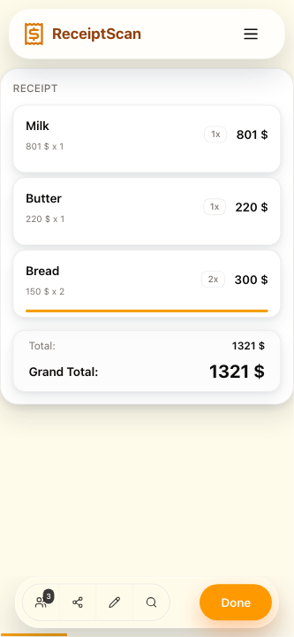

Edge cases распределения

#### `partial` и `full` distribution открывают разные first states

Это очень важное UX-решение:

- `partial` ведёт пользователя сразу в незавершённое действие;
- `full` показывает существующую структуру и только затем предлагает добавить новую долю.

#### Draft editor tolerant к промежуточным numeric states

Сохранение `1.` и автоматическое превращение `.` в `0.` — это не косметика, а признак ориентации на реальный мобильный ввод.

#### Claim errors не равны structural errors

Некорректные `claims` не возвращают весь экран в `validation`, а продолжают жить внутри распределительного режима.

Визуальные пробелы по claims

Для ключевых сценариев этого блока baseline теперь есть. Отдельного переходного кадра для смены `splitting`/`summary` всё ещё нет, потому что тесты там фиксируют вызов `proceed()`, а не устойчивое промежуточное UI-состояние.

---

## 11. Сценарии: participants

### 11.1. Открыть participants из action bar

**Цель пользователя**
Проверить или изменить состав участников, не теряя контекста текущей формы.

**Поведение**

- открывается `ParticipantsSheet`;
- search context сохраняется, если он был;
- пользователь остаётся внутри того же большого сценария работы с чеком.

[Скриншот](../../app/receipt/components/__tests__/__screenshots__/ReceiptFormInner.browser.test.tsx/search-over-participants-sheet-chromium.png)

---

## 12. Сценарии: action bar и создание новых сущностей

### 12.1. Открыть add position в `validation`

**Правило**
В `validation` поле `overall` editable.

**Смысл**
Когда чек уже невалиден, пользователь должен иметь право восстановить totals вручную, а не только через derived arithmetic.

[Скриншот](../../app/receipt/components/__tests__/__screenshots__/ReceiptFormInner.browser.test.tsx/validation-add-position-dialog-chromium.png)
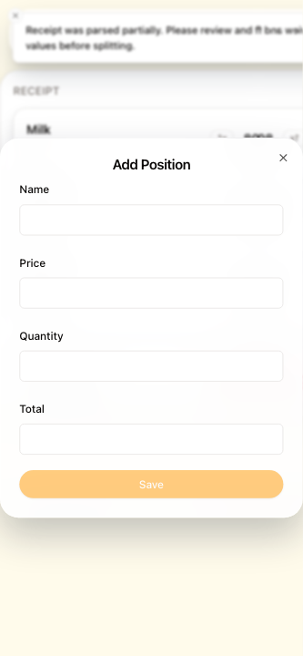

### 12.2. Добавить позицию в `splitting`

**Правило**
В `splitting` `overall` disabled и вычисляется автоматически как `price * quantity`.

**Продуктовый смысл**
После достижения рабочего состояния экран минимизирует число независимых degrees of freedom и предпочитает derived totals.

[Скриншот](../../app/receipt/components/__tests__/__screenshots__/ReceiptFormInner.browser.test.tsx/position-added-chromium.png)
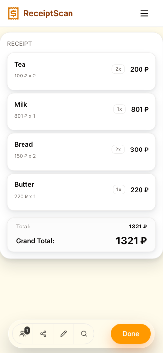

### 12.3. Добавить `fee`

**Поведение**

- из edit menu открывается modifier dialog;
- после сохранения появляется блок `Сборы:`;
- `grandTotal` визуально остаётся частью общего totals narrative.

[Скриншот](../../app/receipt/components/__tests__/__screenshots__/ReceiptFormInner.browser.test.tsx/modifiers-add-fee-chromium.png)
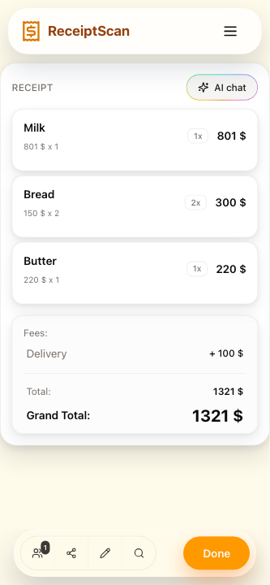

### 12.4. Добавить `discount`

[Скриншот](../../app/receipt/components/__tests__/__screenshots__/ReceiptFormInner.browser.test.tsx/modifiers-add-discount-chromium.png)
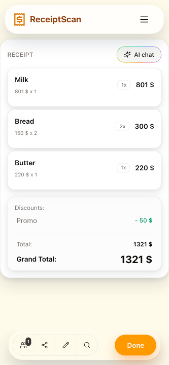

---

## 13. Сценарии: modifiers

### 13.1. Отредактировать существующий `fee`

[Скриншот](../../app/receipt/components/__tests__/__screenshots__/ReceiptFormInner.browser.test.tsx/modifiers-fee-edited-chromium.png)
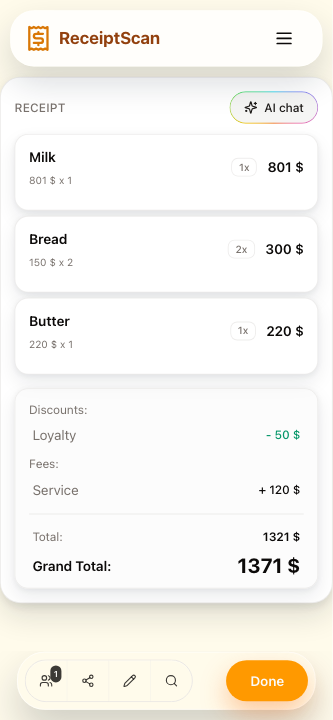

### 13.2. Отредактировать существующий `discount`

[Скриншот](../../app/receipt/components/__tests__/__screenshots__/ReceiptFormInner.browser.test.tsx/modifiers-discount-edited-chromium.png)
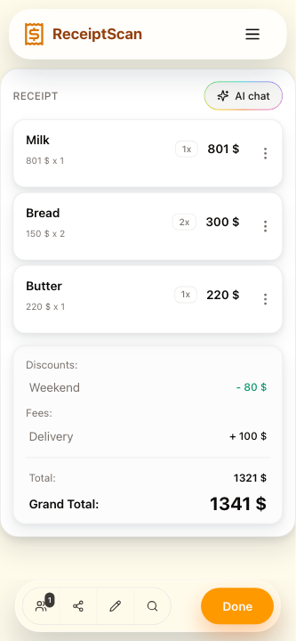

### 13.3. Удалить `fee`

**Поведение**
Если `fees` больше нет, заголовок секции должен исчезнуть.

[Скриншот](../../app/receipt/components/__tests__/__screenshots__/ReceiptFormInner.browser.test.tsx/modifiers-fee-deleted-chromium.png)
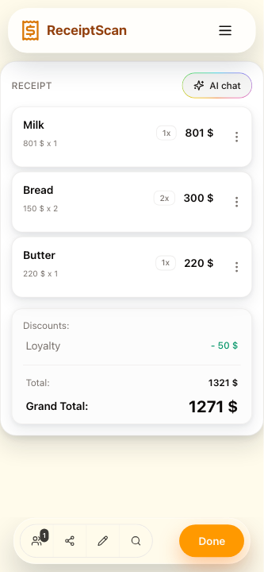

### 13.4. Удалить `discount`

**Поведение**
Если `discounts` больше нет, заголовок секции должен исчезнуть.

[Скриншот](../../app/receipt/components/__tests__/__screenshots__/ReceiptFormInner.browser.test.tsx/modifiers-discount-deleted-chromium.png)
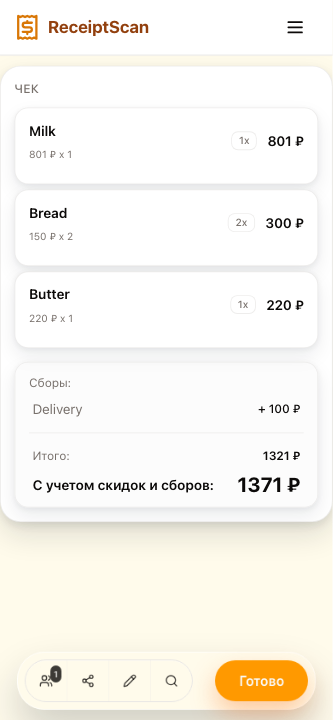

Edge cases modifiers

#### `fees` и `discounts` это не просто line items

Они живут отдельно от `positions`, но визуально встроены в totals narrative. Это означает, что их UX нельзя редуцировать до “ещё один список”.

#### После удаления пустые секции исчезают

Экран не должен оставлять structural shells без данных. Это важно для читаемости totals block.

Визуальные пробелы по modifiers

Ключевые CRUD-состояния по `fee` и `discount` теперь покрыты baseline-скриншотами.

---

## 14. Сценарии: totals

### 14.1. Открыть totals editing в `validation`

**Правило**
В `validation` totals редактируемы и могут быть invalid уже на входе.

[Скриншот](../../app/receipt/components/__tests__/__screenshots__/ReceiptFormInner.browser.test.tsx/validation-totals-invalid-dialog-chromium.png)
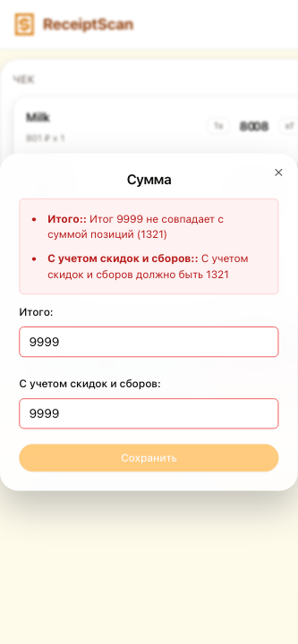

### 14.2. Сохранить totals до server echo

**Поведение**
UI должен немедленно отразить редактирование totals до прихода серверного подтверждения.

**Продуктовый смысл**
Это optimistic UX для данных формы, который уменьшает ощущение задержки и укрепляет доверие к действию пользователя.

[Скриншот](../../app/receipt/components/__tests__/__screenshots__/ReceiptFormInner.browser.test.tsx/validation-totals-optimistic-chromium.png)
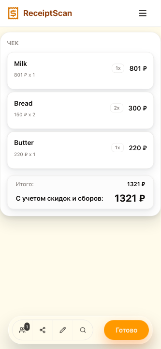

### 14.3. Перевести invalid totals в valid state

**Поведение**

- пользователь исправляет totals;
- форма становится валидной;
- primary action разблокируется;
- пользователь фактически выводится из режима forced review.

[Скриншот](../../app/receipt/components/__tests__/__screenshots__/ReceiptFormInner.browser.test.tsx/validation-totals-fixed-chromium.png)

Edge cases totals

#### В `splitting` totals нередактируемы

Это важное продуктовое решение. После перехода в рабочий режим totals считаются derived domain output, а не произвольным полем.

#### В `validation` totals — один из рычагов спасения некорректного чека

То есть `validation` intentionally допускает больше ручной свободы, чем `splitting`.

---

## 15. Сценарии: редактирование позиции в `validation`

### 15.1. Открыть позицию с invalid name

**Поведение**

- editing dialog открывается;
- пустое имя уже подставлено;
- `Сохранить` disabled.

**Смысл**
Экран не прячет проблему, а делает её редактируемой в контексте.

[Скриншот](../../app/receipt/components/__tests__/__screenshots__/ReceiptFormInner.browser.test.tsx/validation-position-invalid-dialog-chromium.png)
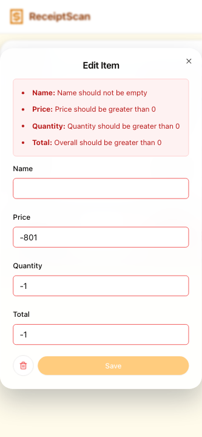

### 15.2. Открыть позицию с overall mismatch

**Поведение**

- данные доступны для просмотра и правки;
- `Сохранить` disabled до исправления;
- mismatch подсвечивается как реальная продуктовая проблема, а не как тихая арифметическая неточность.

[Скриншот](../../app/receipt/components/__tests__/__screenshots__/ReceiptFormInner.browser.test.tsx/validation-position-overall-mismatch-dialog-chromium.png)
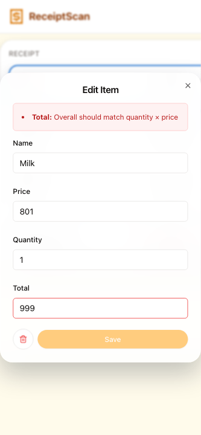

### 15.3. Исправить позицию и вывести форму в valid state

**Поведение**

- после исправления позиции экран становится пригодным к продолжению;
- primary action разблокируется.

[Скриншот](../../app/receipt/components/__tests__/__screenshots__/ReceiptFormInner.browser.test.tsx/validation-position-fixed-chromium.png)

---

## 16. Сценарии: zero-zero позиция

### 16.1. Экран с invalid zero-zero position

**Поведение**

- форма invalid;
- primary action disabled;
- позиция видима и удаляема.

[Скриншот](../../app/receipt/components/__tests__/__screenshots__/ReceiptFormInner.browser.test.tsx/zero-zero-before-delete-chromium.png)
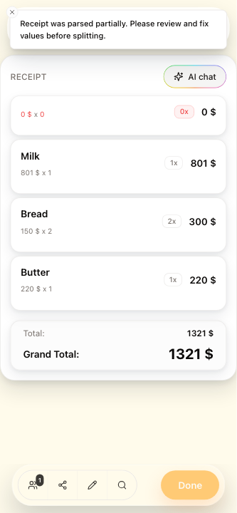

### 16.2. Удалить invalid zero-zero position и дождаться valid state

**Поведение**

- пользователь удаляет строку;
- форма ждёт server-confirmed состояние;
- после подтверждения `Готово` становится enabled;
- позиция больше не возвращается в UI.

[Скриншот](../../app/receipt/components/__tests__/__screenshots__/ReceiptFormInner.browser.test.tsx/zero-zero-after-delete-chromium.png)

### 16.3. Не resurrect deleted zero-zero position

**Правило**
Если следующий server update уже отражает удаление, удалённая строка не должна “воскреснуть”.

[Скриншот](../../app/receipt/components/__tests__/__screenshots__/ReceiptFormInner.browser.test.tsx/zero-zero-not-resurrected-chromium.png)

Edge cases zero-zero позиции

#### Это не просто remove-row

Этот сценарий проверяет устойчивость формы к race condition между локальным удалением и внешним обновлением данных.

#### Правильное поведение: приоритет подтверждённого нового состояния

Форма не должна визуально откатываться к уже удалённой строке только потому, что в поток обновлений попал промежуточный snapshot.

---

## 16A. Сценарии: row conflict при server updates

### 16A.1. `modified conflict` + `Use server`

**Сценарий**

- пользователь редактирует позицию;
- приходит server update для той же строки;
- показывается warning про внешнее изменение;
- пользователь выбирает `Use server`.

**Инвариант**
Локальный draft должен быть заменён серверным значением без потери управляемости формы.

[Скриншот](../../app/receipt/components/__tests__/__screenshots__/ReceiptFormInner.browser.test.tsx/server-update-conflict-use-server-chromium.png)
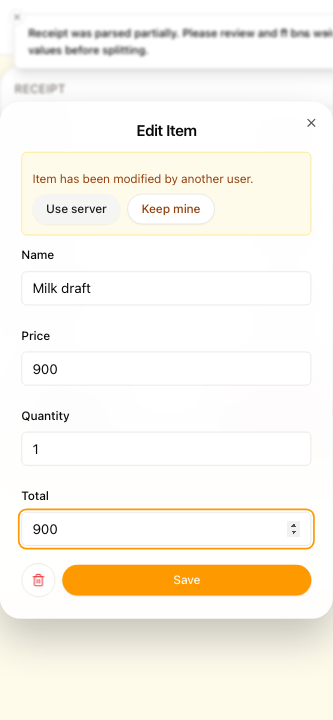

### 16A.2. `modified conflict` + `Keep mine`

**Сценарий**

- пользователь редактирует позицию;
- приходит конкурирующий server update;
- пользователь выбирает `Keep mine`.

**Инвариант**
Локальный draft сохраняется, conflict state очищается, `Save` остаётся доступным при валидном draft.

⚠️ Скриншот отсутствует в baseline: `server-update-conflict-keep-mine`.

### 16A.3. `deleted conflict` для редактируемой строки

**Сценарий**

- позиция открыта в редактировании;
- server update удаляет эту строку;
- показывается `deleted conflict`.

**Инвариант**
`Save` блокируется, чтобы не сохранить изменения в уже удалённую сущность.

[Скриншот](../../app/receipt/components/__tests__/__screenshots__/ReceiptFormInner.browser.test.tsx/server-update-conflict-deleted-chromium.png)
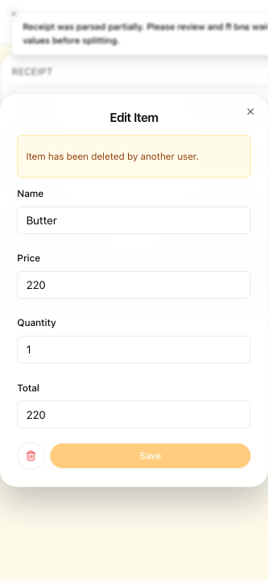

### 16A.4. `pristine auto-replace`

**Сценарий**

- форма/диалог в `pristine` состоянии;
- приходит server update;
- серверное значение применяется автоматически без показа conflict warning.

**Инвариант**
Если пользователь ещё не сделал локальных правок, приоритет у server state.

Визуально отдельным screenshot-baseline это состояние не выделяется; в reference оно фиксируется текстовым сценарием и инвариантом.

---

## 17. Сценарии: claim error после уменьшения позиции

### 17.1. Уменьшить позицию ниже уже распределённого количества

**Сценарий**

- у позиции уже есть claim на `quantity = 2`;
- пользователь уменьшает саму позицию до `quantity = 1`;
- результатом становится конфликт между данными позиции и claims.

**Что происходит**

- экран не скрывает ошибку;
- показывается явное сообщение:
  `Распределенное количество больше количества позиции`;
- `Готово` остаётся disabled.

[Скриншот](../../app/receipt/components/__tests__/__screenshots__/ReceiptFormInner.browser.test.tsx/claim-error-sheet-chromium.png)
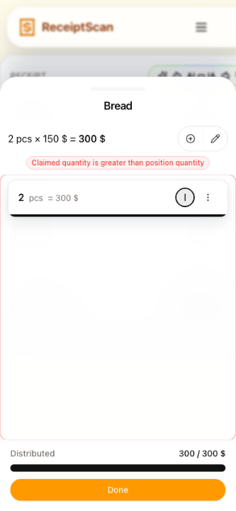

### 17.2. Закрыть sheet и сохранить claim error в основном экране

**Правило**
Закрытие `SplittingSheet` не должно “магически” убирать проблему.

[Скриншот](../../app/receipt/components/__tests__/__screenshots__/ReceiptFormInner.browser.test.tsx/claim-error-after-close-chromium.png)
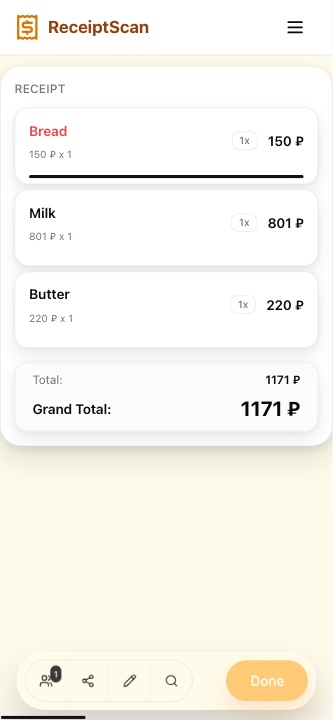

**Продуктовый смысл**
Это очень важный пример того, что форма хранит domain truth, а не только modal-local truth.

---

## 18. Сценарии: `summary`

### 18.1. Показать participant balances и item breakdown

**Цель пользователя**
Понять не только итог по суммам, но и из чего именно он сложился по людям и позициям.

[Скриншот](../../app/receipt/components/__tests__/__screenshots__/ReceiptFormInner.browser.test.tsx/summary-balances-chromium.png)

### 18.2. Показать remaining indicator

**Цель пользователя**
Понять, что распределение ещё не завершено.

**Поведение**

- показывается `Осталось: ...`;
- нераспределённые части не маскируются как будто их не существует;
- summary остаётся честной витриной текущего состояния.

[Скриншот](../../app/receipt/components/__tests__/__screenshots__/ReceiptFormInner.browser.test.tsx/summary-remaining-chromium.png)

### 18.3. Обновить summary после server receipt update

**Поведение**
Summary должен оставаться live representation текущего receipt, а не frozen snapshot.

[Скриншот](../../app/receipt/components/__tests__/__screenshots__/ReceiptFormInner.browser.test.tsx/summary-live-update-remaining-chromium.png)
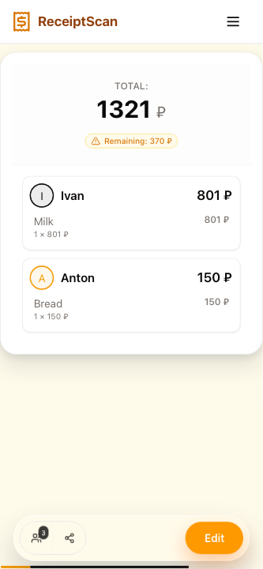

---

## 19. Инварианты экрана

Ниже перечислены правила, которые нужно считать жёсткими продуктово-поведенческими инвариантами.

### 19.1. `summary` никогда не должен быть доступен для invalid receipt

Даже если `summaryInUrl` уже установлен.

### 19.2. `validation` и `splitting` различаются не только визуально, но и степенью разрешённой ручной свободы

В `validation` допустимы ручные исправления totals и `overall`.
В `splitting` форма предпочитает derived arithmetic.

### 19.3. Claim-related issues не эквивалентны structural invalidity

Ошибки claims остаются внутри распределительного контекста.

### 19.4. Totals должны оставаться видимыми при search empty state

Поиск фильтрует список, а не разрушает ментальную модель чека.

### 19.5. Внешние updates должны синхронизироваться с формой, но не должны небрежно перетирать локальный UX

Документируемые признаки этого:

- filtered search results пересчитываются на live updates;
- удалённая zero-zero позиция не должна resurrect;
- totals edits отображаются до server echo.

### 19.6. Ошибка не должна исчезать только потому, что пользователь закрыл overlay

Ключевой пример: `claim-error-after-close`.

### 19.7. Интерактивный элемент должен быть реально интерактивен

В browser-тестах уже зафиксировано, что `pointer-events` имеют значение. Для будущих изменений это важно: визуально видимая строка не должна считаться доступной действием, если она ещё технически non-interactive.

---

## 20. Где экран уже хорош

### 20.1. Экран выдерживает многоступенчатый user journey без разбиения на несколько page types

Это делает flow быстрым и компактным.

### 20.2. `validation` встроен в рабочий экран, а не вынесен в отдельную административную фазу

Пользователь исправляет ошибки там же, где потом продолжает работать.

### 20.3. `summary` хорошо отделён как итоговая витрина

Он не смешан с editing controls и не перегружен search.

### 20.4. Search ведёт себя как зрелый layered UX

Он имеет собственные правила закрытия, очистки, blur и Escape, а не просто одну кнопку “показать input”.

### 20.5. Edge cases уже частично покрыты на уровне продукта, а не только на уровне валидаторов

Это видно по сценариям:

- whitespace search;
- `.` → `0.`;
- trailing decimal separator;
- zero-zero deletion race;
- claim error persistence.

---

## 21. Где экран уже хрупок

### 21.1. Один surface совмещает слишком много обязанностей

`ReceiptForm` одновременно:

- list view
- validation UI
- editing launchpad
- splitting launchpad
- summary toggle surface
- search host
- optimistic sync surface

Это увеличивает продуктовую стоимость каждого изменения.

### 21.2. Граница между mode и submode не всегда очевидна

Примеры:

- search overlay живёт поверх `splitting` и `validation`;
- `SplittingSheet` и `editing dialog` имеют разную семантику, но визуально для пользователя это всё ещё “редактирование”;
- `summary` переключается query-state, а не route-level navigation.

### 21.3. Некоторые критичные сценарии не имеют baseline-скриншота

Это не блокирует разработку, но ухудшает decision confidence.

Ниже перечислены явно зафиксированные пропуски:

- игнорирование `summary` для invalid receipt
- переход `splitting -> summary`
- переход `summary -> splitting`
- очистка поиска close-button
- focus после очистки поиска
- blur-close поиска
- reopen после blur
- close по `Escape`
- whitespace-only search
- reopen после `Escape`
- rename-driven search removal/addition
- several draft-input scenarios в `SplittingSheet`
- добавление новой claim
- bulk participant toggles
- apply `Макс` в quantity/amount
- закрытие `SplittingSheet` по `Готово`
- participants sheet with search preserved
- remove fee / remove discount
- optimistic totals-before-echo
- transition to valid after editing a position
- no-resurrect after deletion
- summary fallback on invalid server update
- summary refresh after server update

---

## 22. Каталог скриншотов

Ниже полный индекс существующих screenshot-baseline.

| Скриншот | Что фиксирует |
| --- | --- |
| `receipt-overview` | canonical working `splitting` state |
| `invalid-review-mode` | `validation` с disabled `Готово` |
| `summary-empty-state` | `summary` без распределений |
| `search-filtered-milk` | filtered list |
| `search-empty-state` | empty search state с сохранением totals |
| `search-over-splitting-sheet` | сохранение search context при открытии `SplittingSheet` |
| `splitting-draft-editor` | partially distributed opening state |
| `splitting-claims-list` | fully distributed opening state |
| `splitting-claim-edited` | результат редактирования claim |
| `splitting-invalid-max-switch` | invalidation max-state после смены unit |
| `splitting-claim-deleted` | результат удаления claim |
| `validation-add-position-dialog` | add position в `validation` |
| `position-added` | добавление позиции в `splitting` |
| `modifiers-add-fee` | добавление `fee` |
| `modifiers-add-discount` | добавление `discount` |
| `modifiers-fee-edited` | редактирование `fee` |
| `modifiers-discount-edited` | редактирование `discount` |
| `validation-position-invalid-dialog` | invalid name |
| `validation-position-overall-mismatch-dialog` | overall mismatch |
| `zero-zero-before-delete` | invalid zero-zero state |
| `zero-zero-after-delete` | valid state после server-confirmed delete |
| `validation-totals-invalid-dialog` | invalid totals editing |
| `validation-totals-fixed` | totals исправлены |
| `claim-error-sheet` | claim error в `SplittingSheet` |
| `claim-error-after-close` | claim error после закрытия sheet |
| `summary-balances` | participant breakdown |
| `summary-remaining` | remaining indicator |

---

## 23. Что этот документ говорит о развитии экрана

### 23.1. Самая важная ось развития — не визуальный редизайн, а управление сложностью режимов

Если экран будет расти дальше, главный риск — не “стало красиво/некрасиво”, а то, что режимы начнут течь друг в друга без ясной модели.

### 23.2. `validation` и `splitting` стоит воспринимать как две разные продуктовые философии

- `validation` допускает ручное спасение данных;
- `splitting` предполагает уже структурно пригодный объект и более узкий коридор действий.

Если эти две философии когда-нибудь захотят разъединить в интерфейсе, этот документ можно использовать как карту того, что именно сейчас удерживается единым surface.

### 23.3. `summary` уже работает как отдельный продуктовый experience, хотя технически остаётся частью формы

Это означает, что его можно отдельно развивать как read-only layer, но только если не нарушить существующий toggle contract между `splitting` и `summary`.

### 23.4. Search уже достаточно сложен, чтобы считаться самостоятельной частью UX

Любой редизайн action bar или overlay-layer должен учитывать:

- close semantics;
- blur semantics;
- Escape semantics;
- сохранение search context через соседние surface.

### 23.5. Наиболее чувствительные зоны для регрессий

- переходы между `validation` / `splitting` / `summary`
- totals editing
- `SplittingSheet`
- modifiers
- race conditions на server updates
- сохранение ошибок после закрытия overlay

---

## 24. Рекомендации по использованию этого документа

Если обсуждается изменение экрана, полезно отвечать на четыре вопроса в терминах этого reference:

1. Какой именно пользовательский сценарий меняется?
2. В каком `scenario.type` это изменение живёт?
3. Какие инварианты затрагиваются?
4. Есть ли уже screenshot на это состояние, и если нет — нужно ли его добавить?

Если на эти вопросы нельзя ответить быстро, изменение почти наверняка затрагивает несколько скрытых слоёв логики и требует отдельного проектирования.
